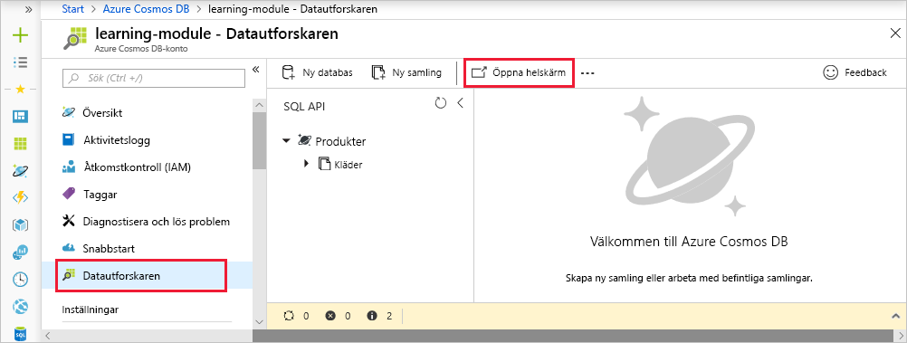
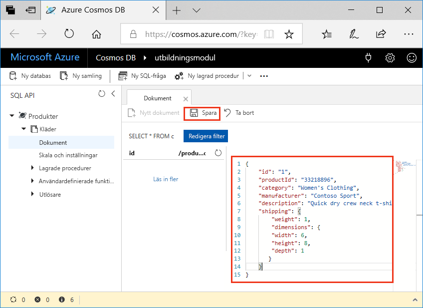

Att lägga till data i din Azure Cosmos DB-databas är enkelt. Öppna Azure Portal, navigera till databasen och använd Datautforskaren till att lägga till JSON-dokument i databasen. Det finns mer avancerade sätt att lägga till data, men vi börjar här eftersom Datautforskaren är ett bra verktyg för att bekanta sig med de egenskaper och funktioner som tillhandahålls av Azure Cosmos DB.

## <a name="what-is-the-data-explorer"></a>Vad är Datautforskaren?
Datautforskaren i Azure Cosmos DB är ett verktyg som ingår i Azure-portalen som används för att hantera data som lagras i en Azure Cosmos DB. Det har ett användargränssnitt för visning och navigering av datasamlingar samt för redigering av dokument i databasen, frågekörning mot data samt för att skapa och köra lagrade procedurer.

## <a name="add-data-using-the-data-explorer"></a>Lägga till data med Datautforskaren

1. Logga in på [Azure Portal för Sandbox](https://portal.azure.com/triplecrownlabs.onmicrosoft.com?azure-portal=true) med samma konto som du aktiverade sandbox-miljön med.

    > [!IMPORTANT]
    > Logga in på Azure Portal och sandbox-miljön med samma konto.
    > 
    > Logga in på Azure Portal med länken ovan för att se till att du är ansluten till sandbox-miljön som ger åtkomst till en Concierge-prenumeration.

1. Klicka på **Alla tjänster** > **Databaser** > **Azure Cosmos DB**. Välj ditt konto, klicka på **Datautforskaren** och klicka sedan på **Öppna i helskärmsläge**.
 
   

2. I rutan **Öppna i helskärmsläge** klickar du på **Öppna**.

    Webbläsaren visar den nya Datautforskaren i helskärm, vilket ger dig mer utrymme och en dedikerad miljö för att arbeta med databasen.

3. För att skapa ett nytt JSON-dokument går du till SQL API-fönsterrutan, expanderar **Kläder**, klickar på **Dokument** och sedan på **Nytt dokument**.

   

4. Lägg nu till ett dokument i samlingen med följande struktur. Det är bara att kopiera och klistra in följande kod i fliken **Dokument** så att det befintliga innehållet överskrivs:

     ```json
    {
        "id": "1",
        "productId": "33218896",
        "category": "Women's Clothing",
        "manufacturer": "Contoso Sport",
        "description": "Quick dry crew neck t-shirt",
        "price": "14.99",
        "shipping": {
            "weight": 1,
            "dimensions": {
            "width": 6,
            "height": 8,
            "depth": 1
           }
        }
    }
     ```

5. När du har lagt till JSON på fliken **Dokument** klickar du på **Spara**.

    

6. Skapa och spara ett dokument till genom att klicka på **Nytt dokument** igen, kopiera följande JSON-objekt till Datautforskaren och klicka på **Spara**.

     ```json
    {
        "id": "2",
        "productId": "33218897",
        "category": "Women's Outerwear",
        "manufacturer": "Contoso",
        "description": "Black wool pea-coat",
        "price": "49.99",
        "shipping": {
            "weight": 2,
            "dimensions": {
            "width": 8,
            "height": 11,
            "depth": 3
           }
        }
    }
     ```

7. Bekräfta att dokumenten har sparats genom att klicka på **Dokument** i den vänstra menyn.

    Datautforskaren visar de två dokumenten på fliken **Dokument**.

I den här enheten har du med hjälp av Datautforskaren lagt till två dokument i databasen, som vart och ett representerar en produkt i din produktkatalog. Datautforskaren är ett bra sätt att skapa dokument, ändra dokument och komma igång med Azure Cosmos DB.  
