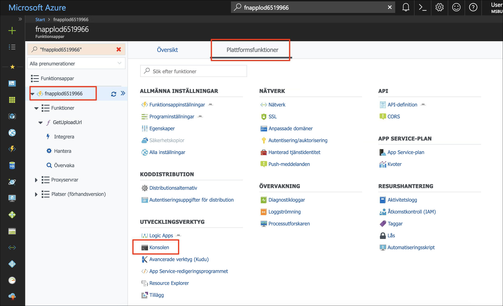
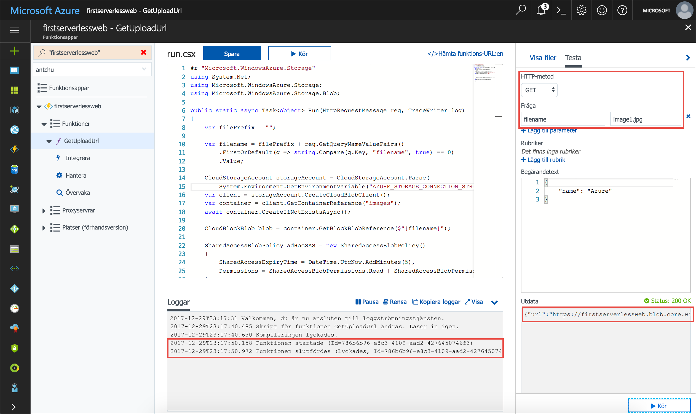

Programmet som du skapar är ett fotogalleri. Programmet använder JavaScript på klientsidan för att anropa API:er för uppladdning och visning av bilder. I den här övningen skapar du ett API med hjälp av en serverlös funktion som genererar en tidsbegränsad URL för uppladdning av en bild. Webbprogrammet använder denna URL för att ladda upp en avbildning till Blob Storage med hjälp av [REST-API:et för Blob Storage](https://docs.microsoft.com/rest/api/storageservices/blob-service-rest-api).

## <a name="create-a-blob-storage-container-for-images"></a>Skapa en Blob Storage-container för bilder

Programmet kräver en separat lagringscontainer för att ladda upp och lagra bilder.

Skapa en ny container med namnet **images** (bilder) i ditt lagringskonto med offentlig åtkomst till alla blobbar.

```azurecli
az storage container create \
    -n images \
    --account-name <storage account name> \
    --public-access blob
```

## <a name="create-a-function-app"></a>Skapa en funktionsapp

Med tjänsten Azure Functions kan du köra serverlösa funktioner. En serverlös funktion kan utlösas (anropas) av händelser såsom en HTTP-begäran eller när en blobb skapas i en lagringscontainer.

En funktionsapp är en container för en eller flera serverlösa funktioner.

Skapa en ny funktionsapp med ett unikt namn. Ett lagringskonto krävs för funktionsappar. I den här övningen använder du det befintliga lagringskonto som du skapade i den senaste enheten.

```azurecli
az functionapp create \
    -n <function app name> \
    -g <rgn>[Sandbox resource group name]</rgn> \
    -s <storage account name> \
    --consumption-plan-location $(az group show -n <rgn>[Sandbox resource group name]</rgn> --query location --output tsv)
```

## <a name="create-an-http-triggered-serverless-function"></a>Skapa en HTTP-utlöst serverlös funktion

Webbappen för fotogalleriet skickar en HTTP-begäran till den serverlösa funktionen för att generera en tidsbegränsad URL för säker uppladdning av en bild till Blob Storage. Funktionen utlöses av en HTTP-begäran och använder Azure Storage SDK för att generera och returnera den säkra URL:en.

1. Logga in på [Azure-portalen](https://portal.azure.com/triplecrownlabs.onmicrosoft.com?azure-portal=true) med samma konto som du använde för att aktivera sandbox-miljön.

1. Sök efter funktionsappen som du nyss skapade med hjälp av **Sökrutan**. Klicka på resultatet för att öppna det.

    

1. I funktionsappfönstrets vänstra navigeringsfönster pekar du på **Functions** och klickar på plustecknet (+) för att skapa en ny serverlös funktion.

    

1. Klicka på **Anpassad funktion** för att visa en lista med funktionsmallar.

1. Leta rätt på mallen **HttpTrigger** och klicka på C# eller JavaScript.

1. Använd dessa värden för att skapa en funktion som genererar en blobbuppladdnings-URL:

    | Inställning      |  Föreslaget värde   | Beskrivning                                        |
    | --- | --- | ---|
    | **Språk** | C# eller JavaScript | Välj det språk som du vill använda. |
    | **Namnge din funktion** | GetUploadUrl | Ange det här namnet exakt så som det visas så att programmet kan identifiera funktionen. |
    | **Auktoriseringsnivå** | Anonym | Gör funktionen offentligt tillgänglig. |

    

1. Klicka på **Skapa** för att skapa funktionen.

::: zone pivot="csharp"

8. När funktionens källkod visas ersätter du allt innehåll i **run.csx**-filen med innehållet i filen [**csharp/GetUploadUrl/run.csx**](https://raw.githubusercontent.com/Azure-Samples/functions-first-serverless-web-application/master/csharp/GetUploadUrl/run.csx).

1. Klicka på **Loggar** under kodfönstret för att expanera loggpanelen.

1. Klicka på **Spara**. Granska loggpanelen för att bekräfta att funktionen har kompilerats.

::: zone-end

::: zone pivot="javascript"

8. Den här funktionen kräver `azure-storage`-paketet från npm. Paketet genererar den SAS-token (signatur för delad åtkomst) som krävs för att skapa den säkra URL:en. Installera npm-paketet genom att klicka på Functions-appen i det vänstra navigeringsfönstret och klicka på **Plattformsfunktioner**.

1. Öppna ett konsolfönster genom att klicka på **Konsol**.

    

1. Kontrollera att den aktuella katalogen är **d:\home\site\wwwroot** genom att köra kommandot `cd d:\home\site\wwwroot`.

1. Kör kommandot `npm init -y` för att skapa en tom **package.json**-fil.

1. Kör kommandot `npm install --save azure-storage` i konsolen för att installera paketet. Spara paketet som **package.json**. Det kan ta några minuter att slutföra åtgärden.

1. Klicka på funktionen (**GetUploadUrl**) i det vänstra navigeringsfönstret för att visa funktionen. Byt ut hela innehållet i filen **index.js** med innehållet i filen [**javascript/GetUploadUrl/index.js**](https://raw.githubusercontent.com/Azure-Samples/functions-first-serverless-web-application/master/javascript/GetUploadUrl/index.js).

    

1. Klicka på **Loggar** under kodfönstret för att expanera loggpanelen.

1. Klicka på **Spara**. Granska loggpanelen för att bekräfta att funktionen har kompilerats.

::: zone-end

Funktionen genererar en SAS-URL (signatur för delad åtkomst) som används för att ladda upp en fil till Blob Storage. SAS-URL:en är giltig under en kort tid och tillåter bara uppladdning av en enda fil. Läs dokumentationen för Blob Storage om du vill veta mer om [hur du använder signaturer för delad åtkomst](https://docs.microsoft.com/azure/storage/common/storage-dotnet-shared-access-signature-part-1).


## <a name="add-an-environment-variable-for-the-storage-connection-string"></a>Lägg till en miljövariabel för anslutningssträngen för lagring

Funktionen som du har skapat behöver en anslutningssträng för lagringskontot för att kunna generera SAS-URL:en. I stället för att hårdkoda anslutningssträngen i funktionens kod kan du lagra den som en programinställning. Alla funktioner i funktionsappen kan komma åt programinställningar som miljövariabler.

1. Hämta anslutningssträngen för lagringskontot från Cloud Shell och spara den i en bash-variabel med namnet **STORAGE_CONNECTION_STRING**.

    ```azurecli
    export STORAGE_CONNECTION_STRING=$(az storage account show-connection-string -n <storage account name> -g <rgn>[Sandbox resource group name]</rgn> --query "connectionString" --output tsv)
    ```

    Bekräfta att variabeln är korrekt angiven.

    ```azurecli
    echo $STORAGE_CONNECTION_STRING
    ```

1. Skapa en ny programinställning med namnet **AZURE_STORAGE_CONNECTION_STRING** genom att använda värdet som sparades i föregående steg.

    ```azurecli
    az functionapp config appsettings set \
        -n <function app name> \
        -g <rgn>[Sandbox resource group name]</rgn> \
        --settings AZURE_STORAGE_CONNECTION_STRING=$STORAGE_CONNECTION_STRING \
        -o table
    ```

    Bekräfta att kommandots utdata innehåller den nya programinställningen med rätt värde.

## <a name="test-the-serverless-function"></a>Testa den serverlösa funktionen

Förutom att skapa och redigera funktioner innehåller Azure Portal även ett inbyggt verktyg för att testa funktioner.

1. Testa den serverlösa HTTP-funktionen genom att klicka på fliken **Testa** till höger om kodfönstret för att expandera testpanelen.

1. Ändra **Http-metoden** till **GET**.

1. Under **Fråga** klickar du på **Lägg till parameter** och lägger till följande parameter:

    | Namn      |  Värde   | 
    | --- | --- |
    | **filename** | image1.jpg |

1. Klicka på **Kör** på testpanelen för att skicka en HTTP-begäran till funktionen.

1. Funktionen returnerar en uppladdnings-URL. Funktionskörningen visas på loggpanelen.

    

## <a name="configure-cors-in-the-function-app"></a>Konfigurera CORS i funktionsappen

Eftersom funktionens klientdel finns i Blob Storage har den ett annat domännamn än funktionsappen. För att JavaScript-koden på klientsidan ska kunna anropa funktionen som du har skapat måste funktionsappen konfigureras för CORS (Cross-Origin Resource Sharing).

1. Klicka på namnet på funktionsappen i det vänstra navigeringsfältet i Funktionsapp-fönstret.

1. Visa en lista med avancerade funktioner genom att klicka på **Plattformsfunktioner**.

1. Klicka på **CORS** under **API**.

    

1. Lägg till tillåtna ursprung URL:en för den webbplats som du skapade i föregående enhet och utelämna det avslutande snedstrecket (/). Till exempel: `https://firstserverlessweb.z4.web.core.windows.net`.

    

1. Klicka på **Spara**.

::: zone pivot="javascript"

6. Medan du är kvar i Azure-portalen går du till Funktionsapp-fönstret och klickar på namnet på din funktionsapp. Välj fliken **Översikt**. Klicka på **Starta om** för att kontrollera om ändringarna för CORS har tillämpats.

::: zone-end

::: zone pivot="csharp"

6. Gå tillbaka till funktionen `GetUploadUrl` och välj fliken **Integrera**.

1. Under **Selected HTTP methods** (Valda HTTP-metoder) väljer du **OPTIONS** (Alternativ).

    **GET**, **POST** och **OPTIONS** bör vara markerade. CORS använder **OPTIONS**-metoden, som inte är markerad som standard för C#-funktioner.  

1. Klicka på **Spara**.

1. Medan du är kvar i Azure-portalen går du till Funktionsapp-fönstret och klickar på namnet på din funktionsapp. Välj fliken **Översikt**. Klicka på **Starta om** för att kontrollera om ändringarna för CORS har tillämpats.

::: zone-end

## <a name="configure-cors-in-the-storage-account"></a>Konfigurera CORS i lagringskontot

Eftersom funktionsappen även gör JavaScript-anrop till Blob Storage för filuppladdning måste du även konfigurera lagringskontot för CORS.

- Kör följande kommando för att tillåta att alla ursprung laddar upp filer till lagringskontot:

    ```azurecli
    az storage cors add --methods OPTIONS PUT --origins '*' --exposed-headers '*' --allowed-headers '*' --services b --account-name <storage account name>
    ```

## <a name="modify-the-web-app-to-upload-images"></a>Ändra webbappen för att ladda upp bilder

Webbappen hämtar inställningar från en fil med namnet **settings.js**. Skapa filen med hjälp av Cloud Shell i de följande stegen. Ange `window.apiBaseUrl` till URL:en för funktionsappen och `window.blobBaseUrl` till URL:en för Azure Blob Storage-slutpunkten.

1. Kontrollera i Cloud Shell att mappen **www/dist** är den aktuella katalogen.

    ```bash
    cd ~/functions-first-serverless-web-application/www/dist
    ```

1. Öppna Cloud Shell-redigeraren i den aktuella katalogen genom att skriva kommandot `code .`, inklusive punkten.

    ```bash
    code .
    ```

1. I Cloud Shell-fönstret under redigeraren kör du en fråga mot funktionsappens URL.

    ```azurecli
    echo "https://"$(az functionapp show -n <function app name> -g <rgn>[Sandbox resource group name]</rgn> --query "defaultHostName" --output tsv)
    ```

1. Lägg till följande rad i redigeringsfönstret med hjälp av funktionsappens URL som du hämtade i föregående steg.

    ```bash
    window.apiBaseUrl = '<function app url>'
    ```

1. I Cloud Shell-fönstret under redigeraren kör du en fråga mot Azure Cloud Shell-slutpunktens URL.

    ```azurecli
    echo $(az storage account show -n <storage account name> -g <rgn>[Sandbox resource group name]</rgn> --query primaryEndpoints.blob -o tsv | sed 's/\/$//')
    ```

1. Lägg till en andra rad i redigeringsfönstret med hjälp av Storage-slutpunktens URL som du hämtade i föregående steg.

    ```bash
    window.blobBaseUrl = '<blob storage endpoint url>'
    ```

1. Spara filen som **settings.js** och stäng redigeraren.

1. Bekräfta att filen skrivits korrekt och att den nu innehåller två rader.

    ```azurecli
    cat settings.js
    ```

1. Ladda upp filen till Blob Storage.

    ```azurecli
    az storage blob upload \
        -c \$web \
        --account-name <storage account name> \
        -f settings.js \
        -n settings.js
    ```

## <a name="test-the-web-application"></a>Testa webbprogrammet

Nu kan galleriprogrammet ladda upp en bild till Blob Storage, men den kan inte visa bilder än. Den kommer att försöka anropa en `GetImages`-funktion som inte finns ännu eftersom du skapar den i en senare modul. Anropet misslyckas och sidan verkar ha fastnat på ”Analyserar...”, men bilden du valt kommer att laddas upp korrekt.

Du kan kontrollera att en bild har laddats upp genom att kontrollera innehållet i containern **images** på Azure Portal.

1. Gå till programmet i ett webbläsarfönster. Välj en bildfil och ladda upp den. Uppladdningen slutförs, men eftersom vi inte har lagt till möjligheten att visa bilder ännu så visar inte appen det uppladdade fotot. (Sidan verkar ha fastnat på ”Analyserar bild...” Du åtgärdar detta senare.)

1. Kontrollera i Cloud Shell att bilden har laddats upp till containern **images**.

    ```azurecli
    az storage blob list \
        --account-name <storage account name> \
        -c images \
        -o table
    ```

1. Ta bort alla filer i containern **images** innan du går vidare till nästa enhet.

    ```azurecli
    az storage blob delete-batch \
        -s images \
        --account-name <storage account name>
    ```

## <a name="summary"></a>Sammanfattning

I den här enheten har du skapat en Azure Functions-app och lärt dig hur du använder en serverlös funktion för att ladda upp bilder till Blob Storage från ett webbprogram. I nästa avsnitt lär du dig att skapa miniatyrbilder för de uppladdade bilderna med hjälp av en blobbutlöst serverlös funktion.