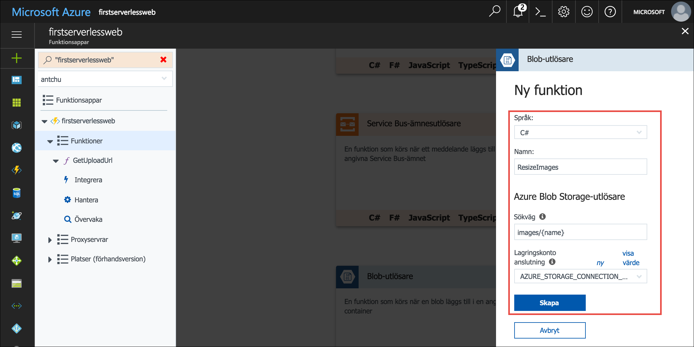
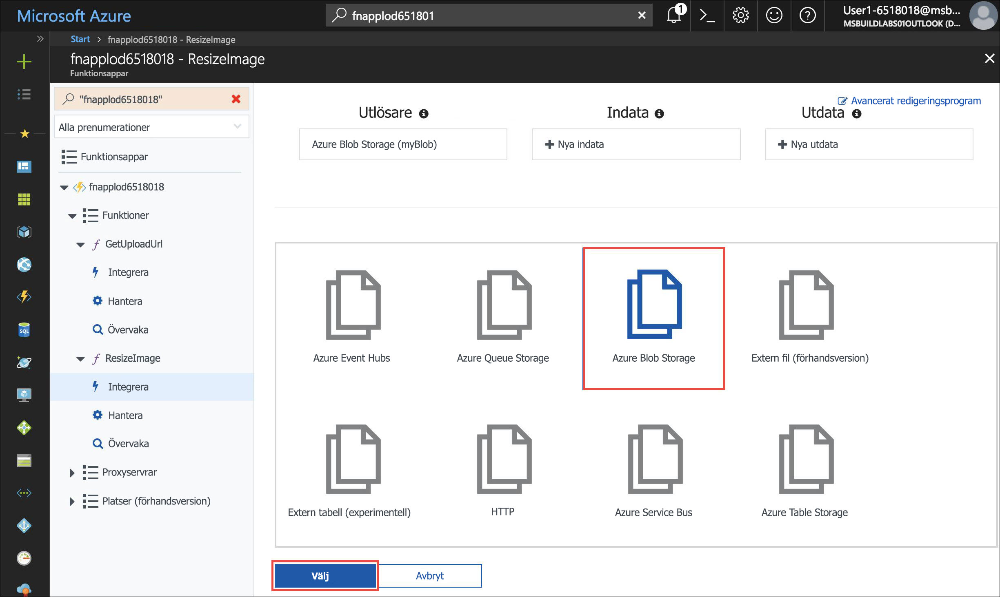
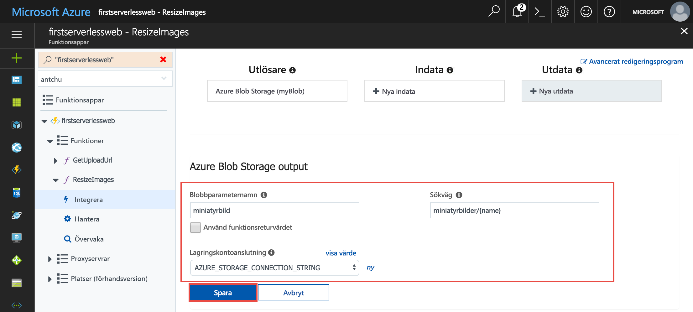
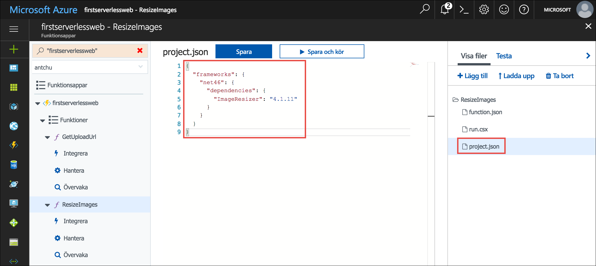

I den föregående delen lärde du dig hur du kan använda en serverlös funktion för att på ett säkert sätt ladda upp bilder till Blob Storage från ett webbprogram. I den här modulen ska du skapa en annan serverlös funktion för att bevaka uppladdade bilder och skapa miniatyrbilder från dem.

## <a name="create-a-blob-storage-container-for-thumbnails"></a>Skapa en Blob Storage-container för miniatyrbilder

Bilderna i fullstorlek lagras i en container med namnet **images** (bilder). Du behöver en annan container för att lagra miniatyrbilderna för dessa bilder.

1. Kontrollera att du fortfarande är inloggad i Cloud Shell (Bash). Om du inte är det väljer du **Enter focus mode** (Växla till fokusläge) för att öppna ett Cloud Shell-fönster. 

1. Skapa en ny container med namnet **thumbnails** (miniatyrbilder) i ditt lagringskonto med offentlig åtkomst till alla blobar.

    ```azurecli
    az storage container create -n thumbnails --account-name <storage account name> --public-access blob
    ```


## <a name="create-a-blob-triggered-serverless-function"></a>Skapa en blobutlöst serverlös funktion

En utlösare definierar hur en funktion anropas. Funktionen du nu ska skapa använder en blob-utlösare. Funktionen anropas automatiskt när en blob (bildfil) laddas upp till containern **images**. En funktion måste ha en utlösare. Utlösare har associerade data, vilket vanligtvis är nyttolasten som utlöste funktionen.

Bindningar definierar hur en funktion läser eller skriver data i Azure eller tredjepartstjänster. Den här funktionen skapar en miniatyrbild för bilden som utlöser den och sparar miniatyrbilden i containern *thumbnails*.

1. Öppna Funktionsapp på Azure-portalen.

1. I Funktionsapp-fönstrets vänstra navigeringsfönstret pekar du på **Functions** och klickar på plustecknet (+) för att skapa en ny serverlös funktion. Om en snabbstartssida visas klickar du på **Anpassad funktion** för att visa en lista med funktionsmallar.

1. Leta upp och välj mallen **BlobTrigger**.

1. Använd dessa värden för att skapa en funktion som genererar miniatyrbilder när bilder laddas upp:

    | Inställning      |  Föreslaget värde   | Beskrivning                                        |
    | --- | --- | ---|
    | **Språk** | C# eller JavaScript | Välj det språk du föredrar. |
    | **Namnge din funktion** | ResizeImage | Ange det här namnet exakt så som det visas så att programmet kan identifiera funktionen. |
    | **Sökväg** | images/{name} | Kör funktionen när en fil läggs till i containern **images**. |
    | **Lagringskontoinformation** | AZURE_STORAGE_CONNECTION_STRING | Använd miljövariabeln som skapades tidigare med anslutningssträngen. |

    

1. Skapa funktionen genom att klicka på **Skapa**.

1. När funktionen har skapats klickar du på **Integrera** för att visa funktionens utlösare, indata och utdatabindningar.

1. Klicka på **Nya utdata** för att skapa en ny utdatabindning.

    

1. Välj **Azure Blob Storage** och klicka på **Välj**. Du kan behöva rulla ned för att se knappen **Välj**.

    

1. Ange följande värden:

    | Inställning      |  Föreslaget värde   | Beskrivning                                        |
    | --- | --- | ---|
    | **Blobparameternamn** | thumbnail | Funktionen använder parametern med det här namnet för att skriva miniatyrbilden. |
    | **Använd funktionsreturvärde** | Nej |  |
    | **Sökväg** | thumbnails/{name} | Miniatyrbilderna skrivs till en container med namnet **thumbnails**. |
    | **Lagringskontoanslutning** | AZURE_STORAGE_CONNECTION_STRING | Använd miljövariabeln som skapades tidigare med anslutningssträngen. |

    


1. **JavaScript**

    1. (JavaScript) Klicka på **Avancerad redigerare** i det övre högra hörnet i fönstret för att visa den JSON som representerar bindningarna.

    1. (JavaScript) Lägg till en egenskap med namnet `dataType` med värdet `binary` i `blobTrigger`-bindningen. När du gör det konfigureras bindningen så att blobinnehållet överförs till funktionen som binära data.

    ```json
    {
      "name": "myBlob",
      "type": "blobTrigger",
      "direction": "in",
      "path": "images/{name}",
      "connection": "AZURE_STORAGE_CONNECTION_STRING",
      "dataType": "binary"
    }
    ```

1. Skapa den nya bindningen genom att klicka på **Spara**.

1. **C#**

    1. (C#) Välj funktionsnamnet **ResizeImage** i det vänstra navigeringsfönstret för att öppna källkoden för funktionen.

    1. (C#) Funktionen kräver ett NuGet-paket med namnet **ImageResizer** för att generera miniatyrbilderna. NuGet-paket läggs till i C#-funktioner med hjälp av en **project.json**-fil. Skapa filen genom att först klicka på **Visa filer** till höger för att visa filerna som funktionen består av.
    
    1. (C#) Klicka på **Lägg till** för att lägga till en ny fil med namnet **project.json**.
    
    1. (C#) Kopiera innehållet i [**/csharp/ResizeImage/project.json**](https://raw.githubusercontent.com/Azure-Samples/functions-first-serverless-web-application/master/csharp/ResizeImage/project.json) till den nya filen som skapats. Spara filen. Paket återställs automatiskt när filen uppdateras.
    
        
    
    1. (C#) Under **Visa filer**väljer du **run.csx**. Ersätt dess innehåll med innehållet i filen [**/csharp/ResizeImage/run.csx**](https://raw.githubusercontent.com/Azure-Samples/functions-first-serverless-web-application/master/csharp/ResizeImage/run.csx).

1. **JavaScript** 

    1. (JavaScript) Den här funktionen kräver `jimp`-paketet från npm för att ändra storlek på fotot. Du installerar npm-paketet genom att klicka på Funktionsapp-namnet i det vänstra navigeringsfönstret och klicka på **Plattformsfunktioner**.

    1. (JavaScript) Öppna ett konsolfönster genom att klicka på **Konsol**.

    1. (JavaScript) Kör kommandot `npm install jimp` i konsolen. Det kan ta några minuter att slutföra åtgärden.

    1. (JavaScript) Klicka på funktionsnamnet **ResizeImage** i det vänstra navigeringsfönstret för att visa funktionen. Byt ut hela **index.js**-filen mot innehållet i filen [**/javascript/ResizeImage/index-module5.js**](https://raw.githubusercontent.com/Azure-Samples/functions-first-serverless-web-application/master/javascript/ResizeImage/index.js).

1. Expandera loggpanelen genom att klicka på **Loggar** under kodfönstret.

1. Klicka på **Spara**. Kontrollera loggpanelen för att bekräfta att funktionen har sparats och att det inte har uppstått några fel.


## <a name="test-the-serverless-function"></a>Testa den serverlösa funktionen

1. Öppna programmet i en webbläsare. Välj en bildfil och ladda upp den. Uppladdningen slutförs, men eftersom vi inte har lagt till möjligheten att visa bilder ännu så visar inte appen det uppladdade fotot.

1. Bekräfta i Cloud Shell att bilden har laddats upp till containern **images**.

    ```azurecli
    az storage blob list --account-name <storage account name> -c images -o table
    ```

1. Kontrollera att miniatyrbilden har skapats i en container med namnet **thumbnails**.

    ```azurecli
    az storage blob list --account-name <storage account name> -c thumbnails -o table
    ```

1. Hämta URL:en för miniatyrbilden.

    ```azurecli
    az storage blob url --account-name <storage account name> -c thumbnails -n <filename> --output tsv
    ```

    Öppna URL:en i en webbläsare och bekräfta att miniatyrbilden har skapats korrekt.

1. Ta bort alla filer i containrarna **images** och **thumbnails** innan du går vidare till nästa självstudie.

    ```azurecli
    az storage blob delete-batch -s images --account-name <storage account name>
    ```
    ```azurecli
    az storage blob delete-batch -s thumbnails --account-name <storage account name>
    ```


## <a name="summary"></a>Sammanfattning

I den här delen har du skapat en serverlös funktion som genererar en miniatyrbild varje gång en bild laddas upp till en Blob Storage-container. I nästa avsnitt lär du dig hur du använder Azure Cosmos DB för att lagra och visa bildmetadata.