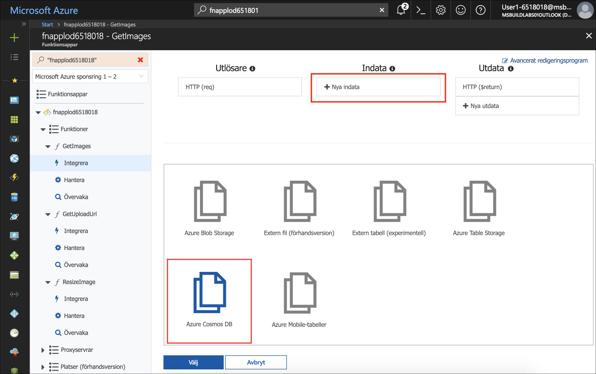
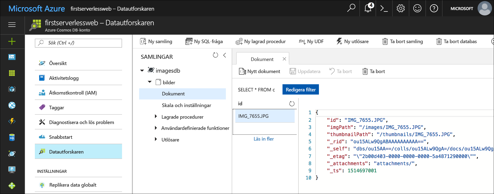

Azure Cosmos DB är Microsofts serverlösa, globalt distribuerade databas för flera datamodeller. I den här modulen lär du dig hur du använder Azure Functions för att lagra och hämta bildmetadata som JSON-dokument i Azure Cosmos DB.

## <a name="create-an-azure-cosmos-db-account-database-and-collection"></a>Lär dig att skapa ett Azure Cosmos DB-konto, en databas och en samling

Ett Azure Cosmos DB-konto är en Azure-resurs som innehåller Azure Cosmos DB-databaser.

1. Kontrollera att du fortfarande är inloggad i Cloud Shell. Om du inte är det väljer du **Enter focus mode** (Växla till fokusläge) för att öppna ett Cloud Shell-fönster. 

1. Skapa ett Azure Cosmos DB-konto med ett unikt namn i samma resursgrupp som de andra resurserna i den här självstudien.

    ```azurecli
    az cosmosdb create -g first-serverless-app -n <cosmos db account name>
    ```

1. När Azure Cosmos DB-kontot har skapats skapar du en ny databas med namnet **imagesdb** i kontot.

    ```azurecli
    az cosmosdb database create -g first-serverless-app -n <cosmos db account name> --db-name imagesdb
    ```

1. När databasen har skapats skapar du en ny samling med namnet **images** i databasen med ett dataflöde på 400 enheter för programbegäran (RU:er).

    ```azurecli
    az cosmosdb collection create -g first-serverless-app -n <cosmos db account name> --db-name imagesdb --collection-name images --throughput 400
    ```


## <a name="save-a-document-to-azure-cosmos-db-when-a-thumbnail-is-created"></a>Spara ett dokument till Azure Cosmos DB när en miniatyrbild skapas

Med Azure Cosmos DB-utdatabindningen kan du skapa dokument i en Azure Cosmos DB-samling från Azure Functions. I följande steg ska du konfigurera en Azure Cosmos DB-utdatabindning i funktionen **ResizeImage** och ändra funktionen så att den returnerar ett dokument (objekt) som ska sparas.

1. Öppna funktionsappen på [Azure Portal](https://portal.azure.com/?azure-portal=true).

1. Expandera funktionen **ResizeImage** i det vänstra navigeringsfönstret och välj **Integrera**.

1. Klicka på **Nya utdata** under **Utdata**.

1. Leta upp och markera **Azure Cosmos DB**-objektet. Klicka sedan på **Välj**.

    

1. Fyll i fälten under **Azure Cosmos DB-utdata** med följande värden.

    | Inställning      |  Föreslaget värde   | Beskrivning                                        |
    | --- | --- | ---|
    | **Dokumentparameternamn** | Välj **Använd funktionsreturvärde**. | Värdet i textrutan ställs automatiskt in till **$return**. |
    | **Databasnamn** | imagesdb | Använd namnet på databasen som du skapade. |
    | **Samlingsnamn** | images | Använd namnet på samlingen som du skapat. |

1. Klicka på **Ny** bredvid **Azure Cosmos DB-kontoanslutningen**. Välj Azure Cosmos DB-kontot som du skapade tidigare.

    

1. Skapa Azure Cosmos DB-utdatabindningen genom att klicka på **Spara**.

1. Klicka på funktionsnamnet **ResizeImage** till vänster för att öppna funktionen.

::: zone pivot="csharp"
1. (C#) Ändra returtypen för funktionen från **void** till **object**.

1. (C#) Returnera dokumentet som ska sparas genom att lägga till följande kodblock i slutet av funktionen:

    ```csharp
    return new {
        id = name,
        imgPath = "/images/" + name,
        thumbnailPath = "/thumbnails/" + name
    };
    ```

    

::: zone-end

::: zone pivot="javascript"
1. (JavaScript) Ändra instruktionen `context.done()` i `else`-satsen så att dokumentet returneras för att sparas i Azure Cosmos DB.

    ```javascript
    if (error) {
        context.done(error);
    } else {
        context.bindings.thumbnail = stream;
        context.done(null, {
            id: context.bindingData.name,
            imgPath: "/images/" + context.bindingData.name,
            thumbnailPath: "/thumbnails/" + context.bindingData.name
        });
    }
    ```

::: zone-end

1. Klicka på **Loggar** under kodfönstret för att expandera loggpanelen.

1. Klicka på **Spara**. Kontrollera loggpanelen för att bekräfta att funktionen har sparats och att det inte har uppstått några fel.


## <a name="create-a-function-to-list-images-from-azure-cosmos-db"></a>Skapa en funktion för att visa bilderna från Azure Cosmos DB

Webbprogrammet kräver ett API för att hämta bildmetadata från Azure Cosmos DB. I följande steg ska du skapa en HTTP-utlöst funktion som använder en Azure Cosmos DB-indatabindning för att fråga databassamlingen.

1. Peka på **Funktioner** till vänster i Funktionsapp och klicka på plustecknet (+) för att skapa en ny funktion.

1. Leta upp och välj mallen **HttpTrigger**.

1. Använd dessa värden för att skapa en funktion som genererar en URL för att hämta bilder:

    | Inställning      |  Föreslaget värde   | Beskrivning                                        |
    | --- | --- | ---|
    | **Namnge din funktion** | GetImages | Ange det här namnet exakt så som det visas så att programmet kan identifiera funktionen. |
    | **Auktoriseringsnivå** | Anonym | Gör funktionen offentligt tillgänglig. |

1. Klicka på **Skapa**.

1. När den nya funktionen har skapats klickar du på **Integrera** under funktionens namn i det vänstra navigeringsfönstret.

1. Klicka på **Nya indata** och välj **Azure Cosmos DB**. 

    

1. Klicka på **Välj**.

1. Fyll i följande värden:

    | Inställning      |  Föreslaget värde   | Beskrivning                                        |
    | --- | --- | ---|
    | **Dokumentparameternamn** | documents | Matchar parameternamnet i funktionen. |
    | **Databasnamn** | imagesdb |  |
    | **Samlingsnamn** | images |  |
    | **SQL-fråga** | select * from c order by c._ts desc | Hämta dokument, de senaste dokumenten först. |
    | **Azure Cosmos DB-kontoanslutning** | Välj den befintliga anslutningssträngen. |  |

1. Skapa indatabindningen genom att klicka på **Spara**.

::: zone pivot="csharp"
1. Klicka på funktionsnamnet för att öppna kodfönstret. Byt ut hela filen **run.csx** mot innehållet i filen [**/csharp/GetImages/run.csx**](https://raw.githubusercontent.com/Azure-Samples/functions-first-serverless-web-application/master/csharp/GetImages/run.csx).

::: zone-end

::: zone pivot="javascript"
1. Klicka på funktionsnamnet för att öppna kodfönstret. Byt ut hela filen **index.js** med innehållet i filen [**/javascript/GetImages/index.js**](https://raw.githubusercontent.com/Azure-Samples/functions-first-serverless-web-application/master/javascript/GetImages/index.js).

::: zone-end

1. Klicka på **Loggar** under kodfönstret för att expandera loggpanelen.

1. Klicka på **Spara**. Kontrollera loggpanelen för att bekräfta att funktionen har sparats och att det inte har uppstått några fel.

## <a name="test-the-application"></a>Testa programmet

1. Öppna programmet i en webbläsare. Välj en bildfil och ladda upp den.

1. Efter några sekunder visas miniatyrbilden för den nya bilden på sidan.

1. Använd rutan **Sök** på Azure-portalen för att söka efter ditt Azure Cosmos DB-konto efter namn. Klicka på namnet för att öppna kontot.

1. Klicka på **Datautforskaren** till vänster för att hitta samlingar och dokument.

1. Välj samlingen **images** under databasen **imagesdb**.

1. Kontrollera att ett dokument har skapats för den uppladdade bilden.

    

## <a name="summary"></a>Sammanfattning

I den här delen har du lärt dig hur du skapar ett konto, en databas och en samling i Azure Cosmos DB. Du har också lärt dig hur du använder Azure Cosmos DB-bindningar till att spara och hämta bildmetadata i Azure Cosmos DB-samlingen. I nästa lektion får du lära dig att automatiskt generera en bildtext för varje uppladdad bild med hjälp av Microsoft Cognitive Services.