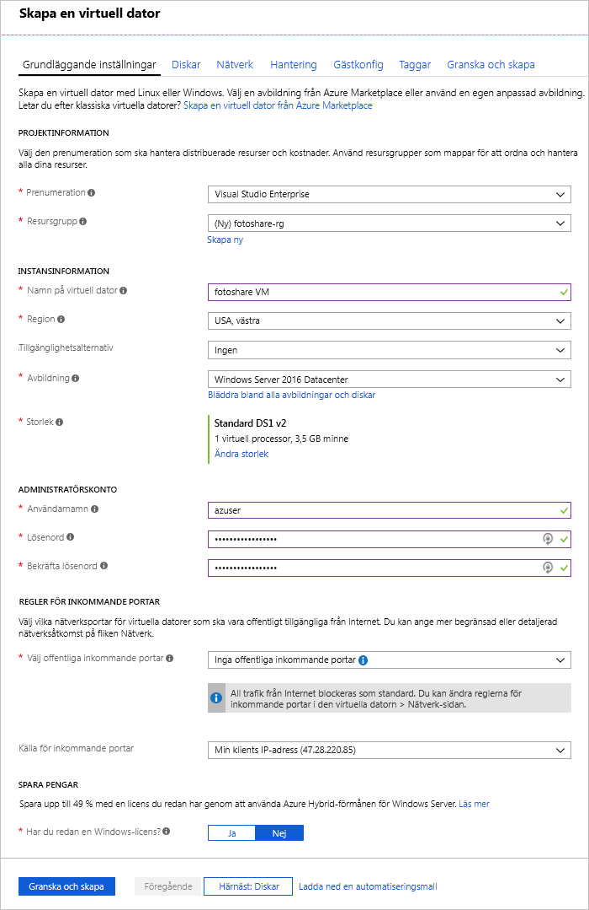

Anta att du kör ett foto dela plats, med data som lagras på Azure-datorer (VM) med SQL Server och anpassade program. Du vill göra följande justeringar:

- Du behöver ändra cacheinställningarna disk på en virtuell dator.
- Du vill lägga till en ny datadisk till den virtuella datorn med cachelagring aktiverat.

Du har valt att göra dessa ändringar via Azure portal.

I den här övningen ska gå vi igenom med ändringarna till en virtuell dator som vi som beskrivs ovan. Först ska vi logga in på portalen och skapa en virtuell dator.

## Logga in på Azure-portalen

[!include]

1. Logga in på [Azure Portal](https://portal.azure.com/?azure-portal=true).

## Skapa en virtuell dator

I det här steget ska vi skapa en virtuell dator med följande egenskaper:

|Egenskap  |Värde  |
|---------|---------|
|Bild     |   **Windows Server 2016 Datacenter**      |
|Namn     |   **fotoshareVM**     |
|Resursgrupp     |   **<rgn>[Sandbox resursgruppens namn]</rgn>**      |

[!include]

1. I den vänstra menyn i portalen, väljer **virtuella datorer**.

1. Välj nu **Lägg till** i upp till vänster på den **virtuella datorer** skärmen. Den här åtgärden startar skapandeprocessen.

1. På den **Compute** panelen som visar en lista över tillgängliga VM-avbildningar, typ *Windows Server 2016 Datacenter* i sökrutan.

1. Välj **Windows Server 2016 Datacenter** sökresultat och välj sedan **skapa** att starta VM-skapandeprocessen.

1. I den **grunderna** panelen, verifiera den valda **prenumeration**.

1. För **resursgrupp**, klickar du på **Skapa nytt** och ge den **namn** av `fotoshare-rg` och klicka på **OK**.

1. i den **virtuellt datornamn** anger `fotoshareVM`.

1. Under **resursgrupp**väljer **Använd befintlig** och välj <rgn>[Sandbox resursgruppens namn]</rgn>.

1. I den **plats** listrutan, väljer du en region i listan ovan.

1. För den virtuella datorn **storlek**, du kan lämna rekommenderade standardinställningarna eller klicka på **ändra storleken på** att välja en annan storlek från den **väljer du en storlek** bladet.

    > [!NOTE]
    > Det finns inga alternativ för att konfigurera diskcachelagring just nu, även i den **diskar** fliken Skapa-bladet.

    > [!IMPORTANT]
    > Kom ihåg att diskcachelagring inte kan ändras för virtuella datorer i L-serien och B-serien. Vi väljer en annan storlek.

1. I **ADMINISTRATÖRSKONTOT** anger en **användarnamn** och **lösenord**/**Bekräfta lösenord** för en administratörskonto på den nya virtuella datorn.

1. Följande bild är ett exempel på vad den **grunderna** konfigurationen ser ut när fyllt i. Lämna standardinställningarna för återstående flikar och fält och klicka på **granska + skapa**.

    

1. När du har granskat din nya VM-inställningarna klickar du på **skapa** att börja distribuera den nya virtuella datorn.

Skapa en virtuell dator kan ta en stund. Vänta tills den virtuella datorn har distribuerats innan du fortsätter med den här övningen. Du får ett meddelande i meddelandehubben när processen är klar.

> [!IMPORTANT]
> Vi använder den här virtuella datorn i nästa kurs, så Håll den runt ett tag!

## Visa status för cache i portalen på operativsystemdisk

När våra virtuella datorn har distribuerats, kan vi bekräfta cachelagringsstatus för OS-disken med följande steg:

1. I den vänstra menyn klickar du på **alla resurser**, och välj sedan den virtuella datorn **fotoshareVM**.

1. På den **VM** bladet under **inställningar**väljer **diskar**.

1. På den **diskar** fönstret den virtuella datorn har en disk, OS-disken. Dess cachetyp är för närvarande inställd på standardvärdet **Läs/Skriv**.

## Ändra inställningar för cachelagring av OS-disken i portalen

1. På den **diskar** väljer **redigera** i det övre vänstra hörnet på skärmen.

1. Ändra den **värden CACHELAGRING** värde för OS-disken till **skrivskyddad** med hjälp av nedrullningsbara listan och välj sedan **spara** i det övre vänstra hörnet på skärmen.

1. Den här uppdateringen kan ta lite tid. Anledningen är att ändra cache-inställningen för en Azure-disk frånkopplas och återansluts sedan måldisken. Om det är operativsystemdisken, startas även den virtuella datorn. När åtgärden har slutförts får du ett meddelande om VM-diskarna har uppdaterats.

1. När du är klar cachetyp för OS-disken är inställd på **skrivskyddad**.

Vi går vidare till data diskkonfigurationen för cache. Om du vill konfigurera en disk, måste du först skapa en.

## Lägga till en datadisk till den virtuella datorn och ange cachelagringstyp

1. Gå tillbaka till den **diskar** vy över våra VM i portalen, gå ahead och välj **Lägg till datadisk**. Ett fel visas omedelbart i den **namn** fält, berätta för oss att fältet inte kan vara tomt. Vi inte har en datadisk ännu, så Låt oss skapa ett.

1. Klicka på listan **Namn** och klicka sedan på **Skapa disk**.

1. I den **skapa hanterad disk** fönstret i den **namn** skriver **fotosharesVM data**.

1. Under **resursgrupp**väljer **Använd befintlig**, och välj <rgn>[Sandbox resursgruppens namn]</rgn>.

1. Lämna övriga fält som standardvärden och klicka på **skapa** längst ned på skärmen.

    Vänta tills disken har skapats innan du fortsätter.

1. Ändra den **värden CACHELAGRING** värde för vår nya datadisken på **skrivskyddad** med hjälp av nedrullningsbara listan och välj sedan **spara** i det övre vänstra hörnet på skärmen.

    Vänta tills den virtuella datorn till den nya datadisken är klar. När du är klar data cache disktypen anges till **skrivskyddad**.

I den här övningen använde vi Azure-portalen för att konfigurera cachelagring på en ny virtuell dator, ändra inställningar för cachelagring på en befintlig disk och konfigurera cachelagring på en ny datadisk. I följande skärmbild visas den slutgiltiga konfigurationen:

