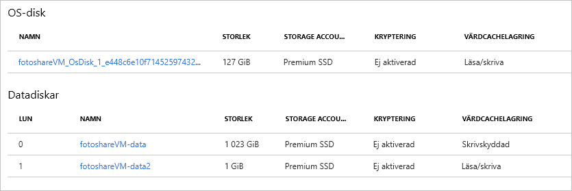

I den föregående övningen utförde vi följande uppgifter med Azure portal:

- Visa OS-disk Cachestatus
- Ändra inställningar för cachelagring av OS-disken
- Lägg till en datadisk i en virtuell dator
- Ändra typ av cachelagring på en ny datadisk

Dags att öva dessa åtgärder med hjälp av Azure PowerShell. Vi ska använda den virtuella datorn som vi skapade i den föregående övningen. Åtgärderna i den här övningen förutsätter:

- Våra virtuella datorn finns och kallas **fotoshareVM**
- Vår virtuella dator finns i en resursgrupp med namnet  **<rgn>[Sandbox resursgruppens namn]</rgn>**

Om du har gått med en annan uppsättning namn, bara ersätta värdena med dina.

Här är det aktuella tillståndet för våra VM-diskar från föregående övning:


Vi har använt portalen för att ange den **värden CACHELAGRING** för både för OS- och diskar. Tänk på detta inledande tillstånd som vi går igenom följande steg.

### <a name="set-up-some-variables"></a>Konfigurera några variabler

Först ska vi lagra vissa resursnamn så att vi kan använda dem senare.

Använd Azure Cloud Shell-terminalen till höger för att köra följande PowerShell-kommandon:

> [!NOTE]
> Växla Cloud Shell-sessionen till **PowerShell** innan du försöker kommandona, om det inte redan.

```powershell
$myRgName = "<rgn>[Sandbox resource group name]</rgn>"
$myVMName = "fotoshareVM"
```

> [!TIP]
> Du måste ange dessa variabler igen om tidsgränsen uppnås för Cloud Shell-sessionen. Så om möjligt har gått igenom den här hela övningen i en enda session.

### <a name="get-info-about-our-vm"></a>Få information om våra VM

Kör följande kommando för att hämta tillbaka egenskaperna för vår virtuella dator:

```powershell
$myVM = Get-AzureRmVM -ResourceGroupName $myRgName -VMName $myVmName
```

Vi lagrar på svaret i vår `$myVM` variabeln. Vi kan köra följande kommando för att visa oss egenskaperna som vi anger här:

```powershell
$myVM | select-object -property ResourceGroupName, Name, Type, Location
```

Som i följande skärmbild visas är den här virtuella datorn verkligen den virtuella datorn som vi letar efter. Så Låt oss gå vidare.


### <a name="view-os-disk-cache-status"></a>Visa OS-disk Cachestatus

Vi kan kontrollera inställningen cachelagring via den `StorageProfile` objekt enligt följande:

```powershell
$myVM.StorageProfile.OsDisk.Caching
```

I det här exemplet är det aktuella värdet är `None`. Nu ska vi ändra tillbaka till standardinställningarna för en OS-disk.


### <a name="change-the-cache-settings-of-the-os-disk"></a>Ändra inställningar för cachelagring av OS-disken

Vi kan ange värdet för cachetyp med samma `StorageProfile` objekt enligt följande:

```powershell
$myVM.StorageProfile.OsDisk.Caching = "ReadWrite"
```

Det här kommandot Kör snabbt, vilket bör tala avbrytas något lokalt. Kommandot ändrar bara egenskapen på den `myVM` objekt. Som i följande skärmbild visas, om du uppdaterar den `$myVM` variabeln, värdet för cachelagring inte har ändrats på den virtuella datorn:


För att göra ändringen i Virtuellt datorn, anropa `Update-AzureRmVM`, enligt följande:

```powershell
Update-AzureRmVM -ResourceGroupName $myRGName -VM $myVM
```

Observera att det här anropet tar en stund att slutföra. Som vi uppdaterar den faktiska virtuella datorn, och är Azure startar om den virtuella datorn för att göra ändringen.


Om du uppdaterar den `$myVM` variabeln igen, visas ändringen för objektet. Titta på disken i portalen, skulle du också se ändringen där. Vi går vidare till att skapa en ny datadisk.

### <a name="list-data-disk-info"></a>Diskinformation för listan data

Om du vill se vilka datadiskar som vi har på våra virtuella datorn kör du följande kommando:

```powershell
$myVM.StorageProfile.DataDisks
```

Vi har endast en datadisk för tillfället. Den `Lun` fältet är viktiga. Det är det unika **L**ogical **U**nit **N**lösen. När vi lägger till en annan datadisk vi får ge den ett unikt `Lun` värde.

### <a name="add-a-new-data-disk-to-our-vm"></a>Lägga till en ny datadisk i vår VM

Av praktiska skäl så lagrar vi vår nya Disknamn:

```powershell
$newDiskName = "fotoshareVM-data2"
```

Kör följande `Add-AzureRmVMDataDisk` kommando för att definiera en ny disk:

```powershell
Add-AzureRmVMDataDisk -VM $myVM -Name $newDiskName  -LUN 1  -DiskSizeinGB 1 -CreateOption Empty
```

Vi har gett den här disken en `Lun` värdet för `1` eftersom inte tas. Vi har definierat den disk som vi vill skapa, så det är dags att köra `Update-AzureRmVM` faktiska ändra:

```powershell
Update-AzureRmVM -ResourceGroupName $myRGName -VM $myVM
```

Nu ska vi titta på våra data diskinformation igen:

```powershell
$myVM.StorageProfile.DataDisks
```


Nu har vi två diskar. Vår nya disken har en `Lun` av `1` och standardvärdet för `Caching` är `None`. Låt oss ändra värdet.

### <a name="change-cache-settings-of-new-data-disk"></a>Ändra inställningar för cachelagring av nya data

Vi ändrar egenskaper för en virtuell dator-datadisk med den `Set-AzureRmVMDataDisk` cmdleten enligt följande:

```powershell
Set-AzureRmVMDataDisk -VM $myVM -Lun "1" -Caching ReadWrite
```

Som alltid genomför ändringarna med `Update-AzureRmVM`:

```powershell
Update-AzureRmVM -ResourceGroupName $myRGName -VM $myVM
```

Här är en vy från portalen för vad vi har göra detta i den här övningen. Våra virtuella datorn har nu två datadiskar och vi har justerat alla **värden CACHELAGRING** inställningar. Vi gjorde att alla med bara några få kommandon. Det är kraften hos Azure PowerShell.


