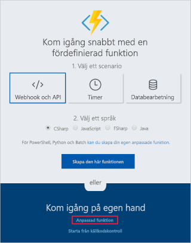
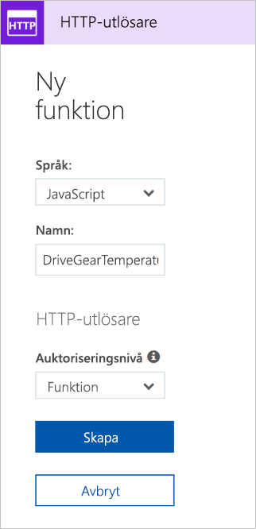
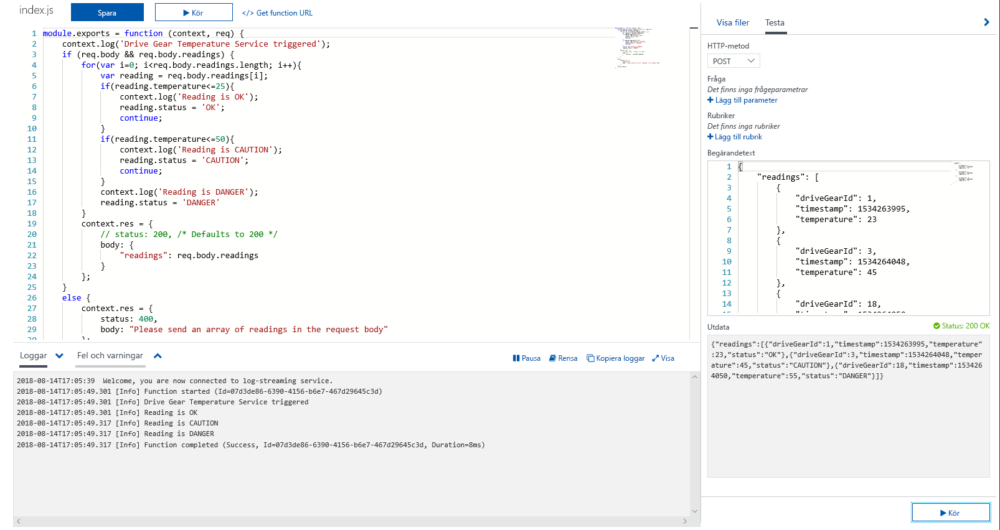

<span data-ttu-id="bf60a-101">Vi fortsätter med vårt exempel om kugghjulsdrift och lägger till logiken för temperaturtjänsten.</span><span class="sxs-lookup"><span data-stu-id="bf60a-101">Let's continue with our gear drive example and add the logic for the temperature service.</span></span> <span data-ttu-id="bf60a-102">Mer specifikt tar vi emot data från en HTTP-begäran.</span><span class="sxs-lookup"><span data-stu-id="bf60a-102">Specifically, we're going to receive data from an HTTP request.</span></span>

## <a name="function-requirements"></a><span data-ttu-id="bf60a-103">Funktionskrav</span><span class="sxs-lookup"><span data-stu-id="bf60a-103">Function requirements</span></span>

<span data-ttu-id="bf60a-104">Först måste vi definiera vissa krav för vår logik:</span><span class="sxs-lookup"><span data-stu-id="bf60a-104">First, we need to define some requirements for our logic:</span></span>

- <span data-ttu-id="bf60a-105">Temperaturer mellan 0–25 ska flaggas som **OK**.</span><span class="sxs-lookup"><span data-stu-id="bf60a-105">Temperatures between 0-25 should be flagged as **OK**.</span></span>
- <span data-ttu-id="bf60a-106">Temperaturer mellan 26–50 ska flaggas som **CAUTION**.</span><span class="sxs-lookup"><span data-stu-id="bf60a-106">Temperatures between 26-50 should be flagged as **CAUTION**.</span></span>
- <span data-ttu-id="bf60a-107">Temperaturer över 50 ska flaggas som **DANGER**.</span><span class="sxs-lookup"><span data-stu-id="bf60a-107">Temperatures above 50 should be flagged as **DANGER**.</span></span>

## <a name="add-a-function-to-our-function-app"></a><span data-ttu-id="bf60a-108">Lägga till en funktion i funktionsappen</span><span class="sxs-lookup"><span data-stu-id="bf60a-108">Add a function to our function app</span></span>

<span data-ttu-id="bf60a-109">Som du såg i föregående kursdel innehåller Azure mallar som hjälper dig att komma igång med att skapa funktioner.</span><span class="sxs-lookup"><span data-stu-id="bf60a-109">As we discussed in the preceding unit, Azure provides templates that help you get started building functions.</span></span> <span data-ttu-id="bf60a-110">I den här övningen ska vi använda mallen `HttpTrigger` för att implementera temperaturtjänsten.</span><span class="sxs-lookup"><span data-stu-id="bf60a-110">In this unit, we'll use the `HttpTrigger` template to implement the temperature service.</span></span>

1. <span data-ttu-id="bf60a-111">Logga in på [Azure Portal](https://portal.azure.com?azure-portal=true) med ditt Azure-konto.</span><span class="sxs-lookup"><span data-stu-id="bf60a-111">Sign in to the [Azure portal](https://portal.azure.com?azure-portal=true) using your Azure account.</span></span>

1. <span data-ttu-id="bf60a-112">Välj resursgruppen som du skapade i den första övningen genom att välja **Alla resurser** på menyn till vänster och sedan välja **escalator-functions-group**.</span><span class="sxs-lookup"><span data-stu-id="bf60a-112">Select the resource group you created in the first exercise by choosing **All resources** in the left-hand menu, and then selecting **escalator-functions-group**.</span></span>

1. <span data-ttu-id="bf60a-113">Gruppens resurser visas.</span><span class="sxs-lookup"><span data-stu-id="bf60a-113">The resources for the group will then be displayed.</span></span> <span data-ttu-id="bf60a-114">Klicka på namnet på den funktionsapp som du skapade i föregående övning genom att välja objektet **escalator-functions-xxxxxxx** (visas med funktionsikonen med en blixt).</span><span class="sxs-lookup"><span data-stu-id="bf60a-114">Click the name of the function app that you created in the previous exercise by selecting the **escalator-functions-xxxxxxx** item (also indicated by the lightning bolt Function icon).</span></span>

  

1. <span data-ttu-id="bf60a-116">På menyn till vänster visas funktionsappens namn och en undermeny med tre objekt: *Funktioner*, *Proxyservrar* och *Platser*.</span><span class="sxs-lookup"><span data-stu-id="bf60a-116">The left-side menu displays your function app name and a submenu with three items: *Functions*, *Proxies*, and *Slots*.</span></span>  <span data-ttu-id="bf60a-117">Börja skapa vår första funktion genom att välja **Funktioner** och sedan klicka på knappen **Ny funktion** högst upp på den sida som visas.</span><span class="sxs-lookup"><span data-stu-id="bf60a-117">To start creating our first function, select **Functions** and click  the **New function** button at the top of the resulting page.</span></span>

  

1. <span data-ttu-id="bf60a-119">På skärmen Snabbstart väljer du länken **Anpassad funktion** i avsnittet **Kom igång på egen hand**, som du ser i följande skärmbild.</span><span class="sxs-lookup"><span data-stu-id="bf60a-119">In the Quickstart screen, select the **Custom function** link in the **Get started on your own** section as shown in the following screenshot.</span></span>

  

1. <span data-ttu-id="bf60a-121">Gå till listan med mallar som visas på skärmen och välj **JavaScript**-implementeringen av **HTTP-utlösarmallen**, som du ser i följande skärmbild.</span><span class="sxs-lookup"><span data-stu-id="bf60a-121">From the list of templates displayed on the screen, select the **JavaScript** implementation of the **HTTP trigger** template as shown in the following screenshot.</span></span>

1. <span data-ttu-id="bf60a-122">Ange **DriveGearTemperatureService** i namnfältet i dialogrutan **Ny funktion** som visas.</span><span class="sxs-lookup"><span data-stu-id="bf60a-122">Enter **DriveGearTemperatureService** in the name field of the **New Function** dialog that appears.</span></span> <span data-ttu-id="bf60a-123">Lämna Auktoriseringsnivå som ”Funktion” och tryck på knappen **Skapa** för att skapa funktionen.</span><span class="sxs-lookup"><span data-stu-id="bf60a-123">Leave the Authorization level as "Function" and press the **Create** button to create the function.</span></span>

  

1. <span data-ttu-id="bf60a-125">När funktionen har skapats öppnas kodredigeraren med innehållet i kodfilen *index.js*.</span><span class="sxs-lookup"><span data-stu-id="bf60a-125">When your function creation completes, the code editor opens with the contents of the *index.js* code file.</span></span> <span data-ttu-id="bf60a-126">Standardkoden som mallen har genererat åt oss visas i följande kodavsnitt.</span><span class="sxs-lookup"><span data-stu-id="bf60a-126">The default code that the template generated for us is listed in the following snippet.</span></span>

```javascript
module.exports = function (context, req) {
    context.log('JavaScript HTTP trigger function processed a request.');

    if (req.query.name || (req.body && req.body.name)) {
        context.res = {
            // status: 200, /* Defaults to 200 */
            body: "Hello " + (req.query.name || req.body.name)
        };
    }
    else {
        context.res = {
            status: 400,
            body: "Please pass a name on the query string or in the request body"
        };
    }
    context.done();
};
```

<span data-ttu-id="bf60a-127">Funktionen förväntar sig att ett namn skickas i frågesträngen för HTTP-begäran eller som en del av själva begäran.</span><span class="sxs-lookup"><span data-stu-id="bf60a-127">Our function expects a name to be passed in either through the HTTP request query string or as part of the request body.</span></span> <span data-ttu-id="bf60a-128">Funktionen svarar genom att returnera meddelandet **Hello, {name}**, med namnet som skickades i begäran.</span><span class="sxs-lookup"><span data-stu-id="bf60a-128">The function responds by returning the message  **Hello, {name}**, echoing back the name that was sent in the request.</span></span>

<span data-ttu-id="bf60a-129">Till höger i källvyn ser du två flikar.</span><span class="sxs-lookup"><span data-stu-id="bf60a-129">On the right-hand side of the source view, you'll find two tabs.</span></span> <span data-ttu-id="bf60a-130">**Visa fil** visar koden och konfigurationsfilen för funktionen.</span><span class="sxs-lookup"><span data-stu-id="bf60a-130">The **View file** lists the code and config file for your function.</span></span>  <span data-ttu-id="bf60a-131">Välj **function.json** för att visa funktionens konfiguration, som bör se ut så här:</span><span class="sxs-lookup"><span data-stu-id="bf60a-131">Select **function.json** to view the configuration of the function, which should look like the following:</span></span>

```javascript
{
    "disabled": false,
    "bindings": [
    {
        "authLevel": "function",
        "type": "httpTrigger",
        "direction": "in",
        "name": "req"
    },
    {
        "type": "http",
        "direction": "out",
        "name": "res"
    }
    ]
}
```

<span data-ttu-id="bf60a-132">Konfigurationen fastställer att funktionen körs när den får en HTTP-begäran.</span><span class="sxs-lookup"><span data-stu-id="bf60a-132">This configuration declares that the function runs when it receives an HTTP request.</span></span> <span data-ttu-id="bf60a-133">Utdatabindningen deklarerar att svaret skickas som ett HTTP-svar.</span><span class="sxs-lookup"><span data-stu-id="bf60a-133">The output binding declares that the response will be sent as an HTTP response.</span></span>

## <a name="test-the-function-using-curl"></a><span data-ttu-id="bf60a-134">Testa funktionen med cURL</span><span class="sxs-lookup"><span data-stu-id="bf60a-134">Test the function using cURL</span></span>

> [!TIP]
> <span data-ttu-id="bf60a-135">**cURL** är ett kommandoradsverktyg som kan användas för att skicka och ta emot filer.</span><span class="sxs-lookup"><span data-stu-id="bf60a-135">**cURL** is a command line tool that can be used to send or receive files.</span></span> <span data-ttu-id="bf60a-136">Det ingår i Linux, macOS och Windows 10 och kan laddas ned för de flesta andra operativsystem.</span><span class="sxs-lookup"><span data-stu-id="bf60a-136">It's included with Linux, macOS, and Windows 10, and can be downloaded for most other operating systems.</span></span> <span data-ttu-id="bf60a-137">cURL har stöd för en rad protokoll, till exempel HTTP, HTTPS, FTP, FTPS, SFTP, LDAP, TELNET, SMTP och POP3. Du kan läsa mer genom att följa länkarna nedan:</span><span class="sxs-lookup"><span data-stu-id="bf60a-137">cURL supports numerous protocols like HTTP, HTTPS, FTP, FTPS, SFTP, LDAP, TELNET, SMTP, POP3, etc. For more information, please refer to the links below:</span></span>
>
>- <https://en.wikipedia.org/wiki/CURL>
>- <https://curl.haxx.se/docs/>

<span data-ttu-id="bf60a-138">Om du vill testa funktionen kan du skicka en HTTP-begäran till funktions-URL:en med hjälp av cURL på kommandoraden.</span><span class="sxs-lookup"><span data-stu-id="bf60a-138">To test the function, you can send an HTTP request to the function URL using cURL on the command line.</span></span> <span data-ttu-id="bf60a-139">Du hittar funktionens slutpunktsadress genom att gå tillbaka till funktionskoden och välja länken **Hämta funktionswebbadress**, som du ser i följande skärmbild.</span><span class="sxs-lookup"><span data-stu-id="bf60a-139">To find the endpoint URL of the function, return to your function code and select the **Get function URL** link, as shown in the following screenshot.</span></span> <span data-ttu-id="bf60a-140">Spara den här länken tills vidare.</span><span class="sxs-lookup"><span data-stu-id="bf60a-140">Save this link temporarily.</span></span>

 

### <a name="securing-http-triggers"></a><span data-ttu-id="bf60a-142">Skydda HTTP-utlösare</span><span class="sxs-lookup"><span data-stu-id="bf60a-142">Securing HTTP triggers</span></span>

<span data-ttu-id="bf60a-143">Med HTTP-utlösare kan du använda API-nycklar för att blockera okända anropare genom att kräva att nyckeln måste finnas i varje begäran.</span><span class="sxs-lookup"><span data-stu-id="bf60a-143">HTTP triggers let you use API keys to block unknown callers by requiring the key to be present on each request.</span></span> <span data-ttu-id="bf60a-144">När du skapar en funktion väljer du _auktoriseringsnivån_.</span><span class="sxs-lookup"><span data-stu-id="bf60a-144">When you create a function, you select the _authorization level_.</span></span> <span data-ttu-id="bf60a-145">Standardinställningen är ”Funktion”, vilket kräver en funktionsspecifik API-nyckel, men den kan också anges till ”Administratör” för användning av en global ”huvudnyckel” eller till ”Anonym” om ingen nyckel krävs.</span><span class="sxs-lookup"><span data-stu-id="bf60a-145">By default, it's set to "Function", which requires a function-specific API key, but it can also be set to "Admin" to use a global "master" key, or "Anonymous" to indicate that no key is required.</span></span> <span data-ttu-id="bf60a-146">Du kan också ändra åtkomstnivån via funktionens egenskaper när du har skapat den.</span><span class="sxs-lookup"><span data-stu-id="bf60a-146">You can also change the authorization level through the function properties after creation.</span></span>

<span data-ttu-id="bf60a-147">Eftersom vi valde ”Funktion” när vi skapade funktionen måste vi ange nyckeln när vi skickar HTTP-begäran.</span><span class="sxs-lookup"><span data-stu-id="bf60a-147">Since we specified "Function" when we created this function, we will need to supply the key when we send the HTTP request.</span></span> <span data-ttu-id="bf60a-148">Du kan skicka den som en frågesträngsparameter med namnet `code`, eller som ett HTTP-huvud (rekommenderas) med namnet `x-functions-key`.</span><span class="sxs-lookup"><span data-stu-id="bf60a-148">You can send it as a query string parameter named `code`, or as an HTTP header (preferred) named `x-functions-key`.</span></span>

<span data-ttu-id="bf60a-149">Funktionen och huvudnycklarna visas i avsnittet **Hantera** när funktionen har expanderats.</span><span class="sxs-lookup"><span data-stu-id="bf60a-149">The function and master keys are found in the **Manage** section when the function is expanded.</span></span> <span data-ttu-id="bf60a-150">De är dolda som standard och du måste uttryckligen visa dem.</span><span class="sxs-lookup"><span data-stu-id="bf60a-150">By default, they are hidden, and you need to display them.</span></span>

1. <span data-ttu-id="bf60a-151">Expandera funktionen och välj avsnittet **Hantera**. Visa standardfunktionsnyckeln och kopiera den till Urklipp.</span><span class="sxs-lookup"><span data-stu-id="bf60a-151">Expand your function and select the **Manage** section, show the default Function Key, and copy it to the clipboard.</span></span>


1. <span data-ttu-id="bf60a-153">Formatera sedan ett cURL-kommando med URL:en för din funktion och funktionsnyckeln.</span><span class="sxs-lookup"><span data-stu-id="bf60a-153">Next, format a cURL command with the URL for your function, and the Function key.</span></span>

    - <span data-ttu-id="bf60a-154">Använd en `POST`-begäran.</span><span class="sxs-lookup"><span data-stu-id="bf60a-154">Use a `POST` request.</span></span>
    - <span data-ttu-id="bf60a-155">Lägg till ett `Content-Type`-huvudvärde av typen `application/json`.</span><span class="sxs-lookup"><span data-stu-id="bf60a-155">Add a `Content-Type` header value of type `application/json`.</span></span>
    - <span data-ttu-id="bf60a-156">Ersätt URL:en nedan med din egen.</span><span class="sxs-lookup"><span data-stu-id="bf60a-156">Make sure to replace the URL below with your own.</span></span>
    - <span data-ttu-id="bf60a-157">Skicka funktionsnyckeln som huvudvärdet `x-functions-key`.</span><span class="sxs-lookup"><span data-stu-id="bf60a-157">Pass the Function Key as the header value `x-functions-key`.</span></span>

    ```bash
    curl --header "Content-Type: application/json" --header "x-functions-key: <your-function-key>" --request POST --data "{\"name\": \"Azure Function\"}" https://<your-url-here>/api/DriveGearTemperatureService
    ```

<span data-ttu-id="bf60a-158">Funktionen svarar med texten `"Hello Azure Function"`.</span><span class="sxs-lookup"><span data-stu-id="bf60a-158">The function will respond back with the text `"Hello Azure Function"`.</span></span>

## <a name="add-business-logic-to-the-function"></a><span data-ttu-id="bf60a-159">Lägga till affärslogik i funktionen</span><span class="sxs-lookup"><span data-stu-id="bf60a-159">Add business logic to the function</span></span>

<span data-ttu-id="bf60a-160">Nu ska vi lägga till logiken till funktionen som kontrollerar temperaturavläsningar som tas emot och som anger en status för var och en.</span><span class="sxs-lookup"><span data-stu-id="bf60a-160">Next, let's add the logic to the function that checks temperature readings that it receives and sets a status for each.</span></span>

<span data-ttu-id="bf60a-161">Funktionen förväntar sig en matris med temperaturavläsningar.</span><span class="sxs-lookup"><span data-stu-id="bf60a-161">Our function is expecting an array of temperature readings.</span></span> <span data-ttu-id="bf60a-162">Följande JSON-kodavsnitt är ett exempel på begäran som vi ska skicka till funktionen.</span><span class="sxs-lookup"><span data-stu-id="bf60a-162">The following JSON snippet is an example of the request body that we'll send to our function.</span></span> <span data-ttu-id="bf60a-163">Varje `reading`-post har ett ID, en tidsstämpel och en temperatur.</span><span class="sxs-lookup"><span data-stu-id="bf60a-163">Each `reading` entry has an ID, timestamp, and temperature.</span></span>

```json
{
    "readings": [
        {
            "driveGearId": 1,
            "timestamp": 1534263995,
            "temperature": 23
        },
        {
            "driveGearId": 3,
            "timestamp": 1534264048,
            "temperature": 45
        },
        {
            "driveGearId": 18,
            "timestamp": 1534264050,
            "temperature": 55
        }
    ]
}
```

<span data-ttu-id="bf60a-164">Nu ska vi ersätta standardkoden i funktionen med följande kod som implementerar vår affärslogik.</span><span class="sxs-lookup"><span data-stu-id="bf60a-164">Next, we'll replace the default code in our function with the following code that implements our business logic.</span></span>

1. <span data-ttu-id="bf60a-165">Öppna filen **index.js** och ersätt den med följande kod.</span><span class="sxs-lookup"><span data-stu-id="bf60a-165">Open the **index.js** file and replace it with the following code.</span></span>

```javascript
module.exports = function (context, req) {
    context.log('Drive Gear Temperature Service triggered');
    if (req.body && req.body.readings) {
        req.body.readings.forEach(function(reading) {

            if(reading.temperature<=25) {
                reading.status = 'OK';
            } else if (reading.temperature<=50) {
                reading.status = 'CAUTION';
            } else {
                reading.status = 'DANGER'
            }
            context.log('Reading is ' + reading.status);
        });

        context.res = {
            // status: 200, /* Defaults to 200 */
            body: {
                "readings": req.body.readings
            }
        };
    }
    else {
        context.res = {
            status: 400,
            body: "Please send an array of readings in the request body"
        };
    }
    context.done();
};
```

<span data-ttu-id="bf60a-166">Logiken som vi lade till är enkel.</span><span class="sxs-lookup"><span data-stu-id="bf60a-166">The logic we added is straightforward.</span></span> <span data-ttu-id="bf60a-167">Vi itererar över matrisen med avläsningar och kontrollerar temperaturfältet.</span><span class="sxs-lookup"><span data-stu-id="bf60a-167">We iterate over the array of readings and check the temperature field.</span></span> <span data-ttu-id="bf60a-168">Beroende på fältets värde anger vi statusen **OK**, **CAUTION** eller **DANGER**.</span><span class="sxs-lookup"><span data-stu-id="bf60a-168">Depending on the value of that field, we set a status of **OK**, **CAUTION**, or **DANGER**.</span></span> <span data-ttu-id="bf60a-169">Sedan skickar vi tillbaka matrisen med avläsningar med ett tillagt statusfält för varje post.</span><span class="sxs-lookup"><span data-stu-id="bf60a-169">We then send back the array of readings with a status field added to each entry.</span></span>

<span data-ttu-id="bf60a-170">Observera `log`-instruktionerna.</span><span class="sxs-lookup"><span data-stu-id="bf60a-170">Notice the `log` statements.</span></span> <span data-ttu-id="bf60a-171">När funktionen körs lägger instruktionerna till meddelanden i loggfönstret.</span><span class="sxs-lookup"><span data-stu-id="bf60a-171">When the function runs, these statements will add messages in the log window.</span></span>

## <a name="test-our-business-logic"></a><span data-ttu-id="bf60a-172">Testa affärslogiken</span><span class="sxs-lookup"><span data-stu-id="bf60a-172">Test our business logic</span></span>

<span data-ttu-id="bf60a-173">I det här fallet ska vi testa funktionen med hjälp av **testfönstret** på portalen.</span><span class="sxs-lookup"><span data-stu-id="bf60a-173">In this case, we're going to use the **Test** pane in the portal to test our function.</span></span>

1. <span data-ttu-id="bf60a-174">Öppna fönstret **Test** från den utfällbara menyn till höger.</span><span class="sxs-lookup"><span data-stu-id="bf60a-174">Open the **Test** window from the right-hand side flyout menu.</span></span>

1. <span data-ttu-id="bf60a-175">Klistra in exempelbegäran, som kopierats ovan, i textrutan för begärandetexten.</span><span class="sxs-lookup"><span data-stu-id="bf60a-175">Paste the sample request, duplicated from above, into the request body text box.</span></span>

    ```json
    {
        "readings": [
            {
                "driveGearId": 1,
                "timestamp": 1534263995,
                "temperature": 23
            },
            {
                "driveGearId": 3,
                "timestamp": 1534264048,
                "temperature": 45
            },
            {
                "driveGearId": 18,
                "timestamp": 1534264050,
                "temperature": 55
            }
        ]
    }
    ```

1. <span data-ttu-id="bf60a-176">Välj **Kör** och visa svaret i utdatafönstret.</span><span class="sxs-lookup"><span data-stu-id="bf60a-176">Select **Run** and view the response in the output pane.</span></span> <span data-ttu-id="bf60a-177">Om du vill visa loggmeddelanden öppnar du fliken **Loggar** på den nedre utfällbara menyn på sidan.</span><span class="sxs-lookup"><span data-stu-id="bf60a-177">To see log messages, open the **Logs** tab in the bottom flyout of the page.</span></span> <span data-ttu-id="bf60a-178">På följande skärmbild visas ett exempelsvar i utdatafönstret och meddelanden i fönstret **Loggar**.</span><span class="sxs-lookup"><span data-stu-id="bf60a-178">The following screenshot shows an example response in the output pane and messages in the  **Logs** pane.</span></span>



<span data-ttu-id="bf60a-181">Du kan se i utdatafönstret att vårt statusfält har lagts till i alla avläsningar.</span><span class="sxs-lookup"><span data-stu-id="bf60a-181">You can see in the output pane that our status field has been correctly added to each of the readings.</span></span>

<span data-ttu-id="bf60a-182">Om du navigerar till instrumentpanelen **Övervaka** ser du att begäran har loggats i Application Insights.</span><span class="sxs-lookup"><span data-stu-id="bf60a-182">If you navigate to the **Monitor** dashboard, you'll see that the request has been logged to Application Insights.</span></span>


