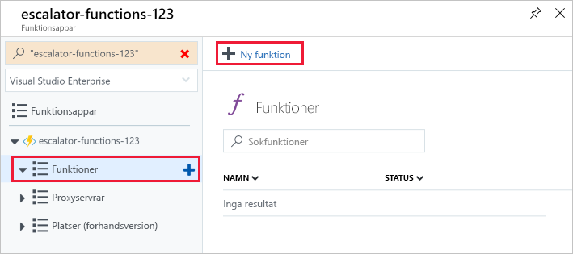
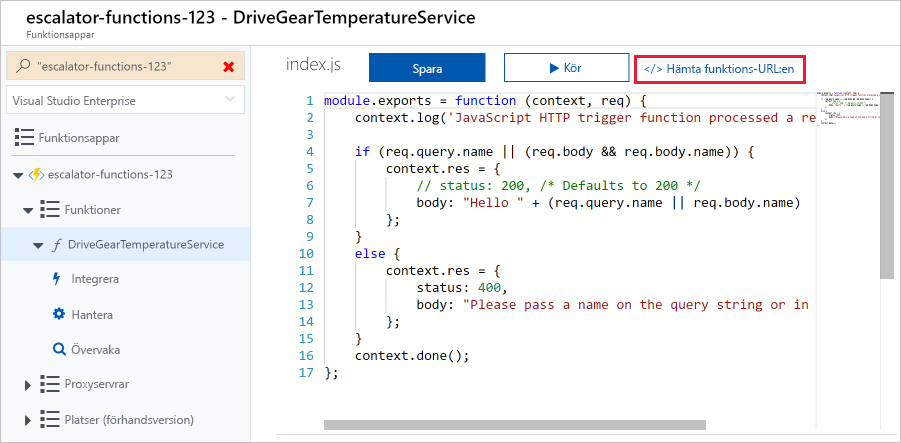
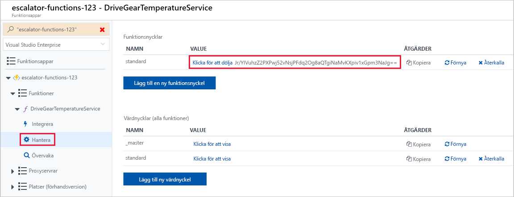

Vi fortsätter med vårt exempel om kugghjulsdrift och lägger till logiken för temperaturtjänsten. Mer specifikt tar vi emot data från en HTTP-begäran.

## <a name="function-requirements"></a>Funktionskrav

Först måste vi definiera vissa krav för vår logik:

- Temperaturer mellan 0–25 ska flaggas som **OK**.
- Temperaturer mellan 26–50 ska flaggas som **CAUTION**.
- Temperaturer över 50 ska flaggas som **DANGER**.

## <a name="add-a-function-to-our-function-app"></a>Lägga till en funktion i funktionsappen

Som du såg i föregående kursdel innehåller Azure mallar som hjälper dig att komma igång med att skapa funktioner. I den här övningen använder vi mallen `HttpTrigger` för att implementera temperaturtjänsten.

1. Logga in på [Azure-portalen](https://portal.azure.com/triplecrownlabs.onmicrosoft.com?azure-portal=true).

1. Välj resursgruppen från den första övningen genom att välja **Alla resurser** på menyn till vänster och sedan välja ”**<rgn>[Namn på Sandbox-resursgrupp]</rgn>**”.

1. Gruppens resurser visas. Klicka på namnet på den funktionsapp som du skapade i föregående övning genom att välja objektet **escalator-functions-xxxxxxx** (visas med funktionsikonen med en blixt).

  

1. På menyn till vänster visas funktionsappens namn och en undermeny med tre objekt: *Funktioner*, *Proxyservrar* och *Platser*.  Börja skapa vår första funktion genom att välja **Funktioner** och sedan klicka på knappen **Ny funktion** högst upp på den sida som visas.

  

1. På skärmen Snabbstart väljer du länken **Anpassad funktion** i avsnittet **Kom igång på egen hand**, som du ser i följande skärmbild. Om du inte ser skärmen Snabbstart klickar du på länken **gå till snabbstarten** längst upp på sidan.

  

1. Gå till listan med mallar som visas på skärmen och välj **JavaScript**-implementeringen av **HTTP-utlösarmallen**, som du ser i följande skärmbild.

1. Ange **DriveGearTemperatureService** i namnfältet i dialogrutan **Ny funktion** som visas. Lämna Auktoriseringsnivå som ”Funktion” och tryck på knappen **Skapa** för att skapa funktionen.

  

1. När funktionen har skapats öppnas kodredigeraren med innehållet i kodfilen *index.js*. Standardkoden som mallen har genererat åt oss visas i följande kodavsnitt.

```javascript
module.exports = function (context, req) {
    context.log('JavaScript HTTP trigger function processed a request.');

    if (req.query.name || (req.body && req.body.name)) {
        context.res = {
            // status: 200, /* Defaults to 200 */
            body: "Hello " + (req.query.name || req.body.name)
        };
    }
    else {
        context.res = {
            status: 400,
            body: "Please pass a name on the query string or in the request body"
        };
    }
    context.done();
};
```

Funktionen förväntar sig att ett namn skickas i frågesträngen för HTTP-begäran eller som en del av själva begäran. Funktionen svarar genom att returnera meddelandet **Hello, {name}**, med namnet som skickades i begäran.

Till höger i källvyn ser du två flikar. Fliken **Visa fil** visar koden och konfigurationsfilen för funktionen.  Välj **function.json** för att visa funktionens konfiguration, som bör se ut så här:

```javascript
{
    "disabled": false,
    "bindings": [
    {
        "authLevel": "function",
        "type": "httpTrigger",
        "direction": "in",
        "name": "req"
    },
    {
        "type": "http",
        "direction": "out",
        "name": "res"
    }
    ]
}
```

Konfigurationen fastställer att funktionen körs när den får en HTTP-begäran. Utdatabindningen deklarerar att svaret skickas som ett HTTP-svar.

## <a name="test-the-function"></a>Testa funktionen

> [!TIP]
> **cURL** är ett kommandoradsverktyg som kan användas för att skicka och ta emot filer. Det ingår i Linux, macOS och Windows 10 och kan laddas ned för de flesta andra operativsystem. cURL har stöd för en rad protokoll, till exempel HTTP, HTTPS, FTP, FTPS, SFTP, LDAP, TELNET, SMTP och POP3. Du kan läsa mer genom att följa länkarna nedan:
>
>- <https://en.wikipedia.org/wiki/CURL>
>- <https://curl.haxx.se/docs/>

Om du vill testa funktionen kan du skicka en HTTP-begäran till funktions-URL:en med hjälp av cURL på kommandoraden. Du hittar funktionens slutpunktsadress genom att gå tillbaka till funktionskoden och välja länken **Hämta funktionswebbadress**, som du ser i följande skärmbild. Spara den här länken tills vidare.



### <a name="securing-http-triggers"></a>Skydda HTTP-utlösare

Med HTTP-utlösare kan du använda API-nycklar för att blockera okända anropare genom att kräva att nyckeln måste finnas i varje begäran. När du skapar en funktion väljer du _auktoriseringsnivån_. Standardinställningen är ”Funktion”, vilket kräver en funktionsspecifik API-nyckel, men den kan också anges till ”Administratör” för användning av en global ”huvudnyckel” eller till ”Anonym” om ingen nyckel krävs. Du kan också ändra åtkomstnivån via funktionens egenskaper när du har skapat den.

Eftersom vi valde ”Funktion” när vi skapade funktionen måste vi ange nyckeln när vi skickar HTTP-begäran. Du kan skicka den som en frågesträngsparameter med namnet `code`, eller som ett HTTP-huvud (rekommenderas) med namnet `x-functions-key`.

Funktionen och huvudnycklarna visas i avsnittet **Hantera** när funktionen har expanderats. De är dolda som standard och du måste uttryckligen visa dem.

1. Expandera funktionen och välj avsnittet **Hantera**. Visa standardfunktionsnyckeln och kopiera den till Urklipp.

  

1. Därefter, gå till kommandoraden där du installerade verktyget **cURL**, formatera ett cURL-kommando med URL:en för din funktion och funktionsnyckeln.

    - Använd en `POST`-begäran.
    - Lägg till ett `Content-Type`-huvudvärde av typen `application/json`.
    - Ersätt URL:en nedan med din egen.
    - Skicka funktionsnyckeln som huvudvärdet `x-functions-key`.

    ```bash
    curl --header "Content-Type: application/json" --header "x-functions-key: <your-function-key>" --request POST --data "{\"name\": \"Azure Function\"}" https://<your-url-here>/api/DriveGearTemperatureService
    ```

Funktionen svarar med texten `"Hello Azure Function"`.

> [!NOTE]
> Du kan också utföra test från en enskild funktions avsnitt med fliken **Test** vid sidan av den valda funktionen, men du kan inte kontrollera om funktionsnyckelsystemet fungerar, eftersom detta inte krävs här. Lägg till lämpligt sidhuvud och parametervärden i testgränssnittet och klicka på knappen **Kör** för att visa testets utdata.

## <a name="add-business-logic-to-the-function"></a>Lägga till affärslogik i funktionen

Nu ska vi lägga till logiken till funktionen som kontrollerar temperaturavläsningar som tas emot och som anger en status för var och en.

Funktionen förväntar sig en matris med temperaturavläsningar. Följande JSON-kodavsnitt är ett exempel på begäran som vi ska skicka till funktionen. Varje `reading`-post har ett ID, en tidsstämpel och en temperatur.

```json
{
    "readings": [
        {
            "driveGearId": 1,
            "timestamp": 1534263995,
            "temperature": 23
        },
        {
            "driveGearId": 3,
            "timestamp": 1534264048,
            "temperature": 45
        },
        {
            "driveGearId": 18,
            "timestamp": 1534264050,
            "temperature": 55
        }
    ]
}
```

Nu ska vi ersätta standardkoden i funktionen med följande kod som implementerar vår affärslogik.

1. Öppna filen **index.js** och ersätt den med följande kod.

```javascript
module.exports = function (context, req) {
    context.log('Drive Gear Temperature Service triggered');
    if (req.body && req.body.readings) {
        req.body.readings.forEach(function(reading) {

            if(reading.temperature<=25) {
                reading.status = 'OK';
            } else if (reading.temperature<=50) {
                reading.status = 'CAUTION';
            } else {
                reading.status = 'DANGER'
            }
            context.log('Reading is ' + reading.status);
        });

        context.res = {
            // status: 200, /* Defaults to 200 */
            body: {
                "readings": req.body.readings
            }
        };
    }
    else {
        context.res = {
            status: 400,
            body: "Please send an array of readings in the request body"
        };
    }
    context.done();
};
```

Logiken som vi lade till är enkel. Vi itererar över matrisen med avläsningar och kontrollerar temperaturfältet. Beroende på fältets värde anger vi statusen **OK**, **CAUTION** eller **DANGER**. Sedan skickar vi tillbaka matrisen med avläsningar med ett tillagt statusfält för varje post.

Observera `log`-instruktionerna. När funktionen körs lägger instruktionerna till meddelanden i loggfönstret.

## <a name="test-our-business-logic"></a>Testa affärslogiken

I det här fallet ska vi testa funktionen med hjälp av **testfönstret** på portalen.

1. Öppna fönstret **Test** från den utfällbara menyn till höger.

1. Klistra in exempelbegäran i textrutan för begärandetexten.

    ```json
    {
        "readings": [
            {
                "driveGearId": 1,
                "timestamp": 1534263995,
                "temperature": 23
            },
            {
                "driveGearId": 3,
                "timestamp": 1534264048,
                "temperature": 45
            },
            {
                "driveGearId": 18,
                "timestamp": 1534264050,
                "temperature": 55
            }
        ]
    }
    ```

1. Välj **Kör** och visa svaret i utdatafönstret. Om du vill visa loggmeddelanden öppnar du fliken **Loggar** på den nedre utfällbara menyn på sidan. På följande skärmbild visas ett exempelsvar i utdatafönstret och meddelanden i fönstret **Loggar**.


Du kan se i utdatafönstret att vårt statusfält har lagts till i alla avläsningar.

Om du navigerar till instrumentpanelen **Övervaka** ser du att begäran har loggats i Application Insights.


