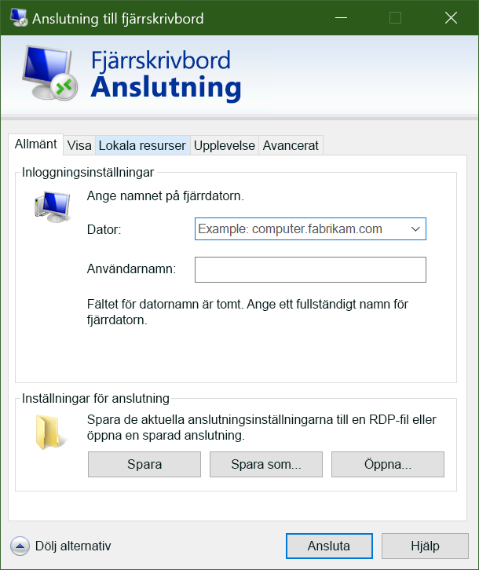

Nu när vi har en virtuell Windows-dator i Azure ska du placera dina program och data på dessa virtuella datorer för att bearbeta våra trafikvideor. 

Men om du inte har konfigurerat plats-till-plats-VPN-anslutning till Azure kan dina virtuella datorer i Azure inte nås från det lokala nätverket. Om du precis har kommit igång med Azure har du troligen inte en fungerande plats-till-plats-VPN-anslutning. Så hur överför du filer till virtuella Azure-datorer? Ett enkelt sätt är att använda funktionen Anslutning till fjärrskrivbord i Azure för att dela dina lokala enheter med dina nya virtuella Azure-datorer.

Nu när vi har en ny virtuell Windows-dator måste vi installera vår egna programvara på den. Det finns två sätt som vi kan använda:

- Remote Desktop Protocol (RDP)
- Anpassade skript
- Anpassade avbildningar av virtuella datorer (med förinstallerad programvara)

Låt oss titta på den enklaste metoden för Windows-datorer: Fjärrskrivbord.

## Vad är Remote Desktop Protocol?

Med Remote Desktop Protocol (RDP) kan du fjärransluta till användargränssnittet i Windows-baserade datorer. Du kan logga in på en fjärransluten fysisk eller virtuell Windows-dator och styra datorn, precis som när du sitter vid den. Med en RDP-anslutning kan du utföra merparten av de åtgärder som du kan göra från konsolen på en fysisk dator, med undantag för vissa ström- och maskinvarurelaterade funktioner.

En RDP-anslutning kräver en RDP-klient. Microsoft tillhandahåller RDP-klienter för följande operativsystem:

- Windows (inbyggt)
- MacOS
- iOS
- Android

Följande skärmbild visar Remote Desktop Protocol-klienten i Windows 10.

Det finns även Linux-klienter med öppen källkod, till exempel Remmina som gör det möjligt att ansluta till en Windows-dator från en Ubuntu-distribution.

## Ansluta till en virtuell Azure-dator

Som vi såg alldeles nyss kommunicerar virtuella Azure-datorer i ett virtuellt nätverk. De kan också ha en valfri offentlig IP-adress som har tilldelats. Med en offentlig IP-adress kan vi kommunicera med den virtuella datorn via Internet. Vi kan också konfigurera ett virtuellt privat nätverk (VPN) som ansluter det lokala nätverket till Azure. Då kan vi på ett säkert sätt ansluta till den virtuella datorn utan att exponera en offentlig IP-adress. Den här metoden beskrivs i en annan modul och är fullständigt dokumenterad om du vill utforska det alternativet.

En sak att tänka på med offentliga IP-adresser i Azure är att de ofta tilldelas dynamiskt. Det innebär att IP-adressen kan ändras över tid – för virtuella datorer sker det när den virtuella datorn startas om. Du kan betala mer för att tilldela statiska adresser om du vill ansluta direkt till en IP-adress i stället för ett namn och se till att IP-adressen inte ändras.

### Hur ansluter du till en virtuell dator i Azure med RDP?

Det är enkelt att ansluta till en virtuell dator i Azure med RDP. Gå till egenskaperna för din virtuella dator i Azure-portalen och klicka på **Anslut** högst upp. Det här visar dig de IP-adresser som tilldelats till den virtuella datorn och ger dig möjlighet att ladda ned en förkonfigurerad **.rdp** -fil som Windows sedan öppnar i RDP-klienten. Du kan välja att ansluta via den offentliga IP-adressen till den virtuella datorn i RDP-filen. Om du ansluter via VPN eller ExpressRoute kan du välja den interna IP-adressen. Du kan också välja portnumret för anslutningen.

Om du använder en statisk offentlig IP-adress för den virtuella datorn kan du spara **.rdp**-filen på skrivbordet. Om du använder dynamisk IP-adresshantering är .rdp-filen endast giltig när den virtuella datorn körs. Om du stoppar och startar om den virtuella datorn måste du hämta en annan .rdp-fil.

> [!TIP]
> Du kan också ange den offentliga IP-adressen till den virtuella datorn i Windows rdp-klient och klicka på **Anslut**.

När du ansluter får du troligtvis två varningar. Dessa är:

-**Utgivarvarning** – **.rdp**-filen har inte signerats offentligt.
- **Certifikatvarning** – datorcertifikatet är inte betrott.

Dessa varningar kan ignoreras i testmiljö. I produktionsmiljö kan **.rdp**-filen signeras med hjälp av **RDPSIGN. EXE** och datorcertifikatet kan placeras i klientens arkiv för **betrodda rotcertifikatutfärdare**.

Nu ska vi prova med RDP för att ansluta till vår virtuella dator.