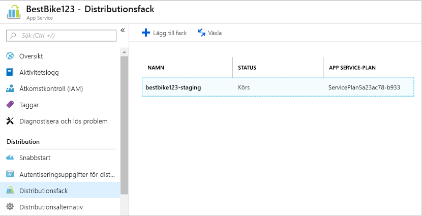
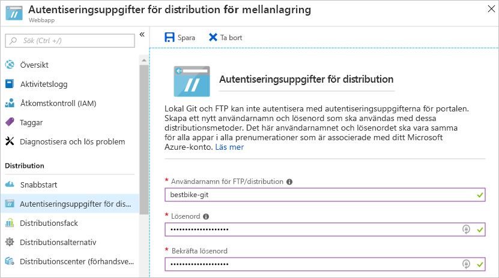
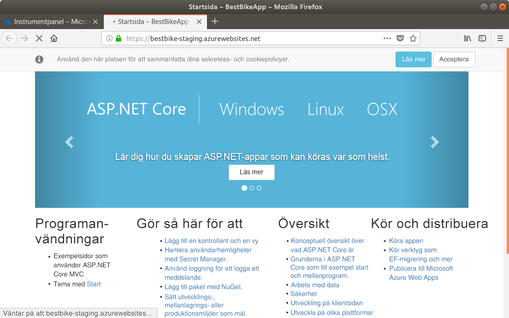
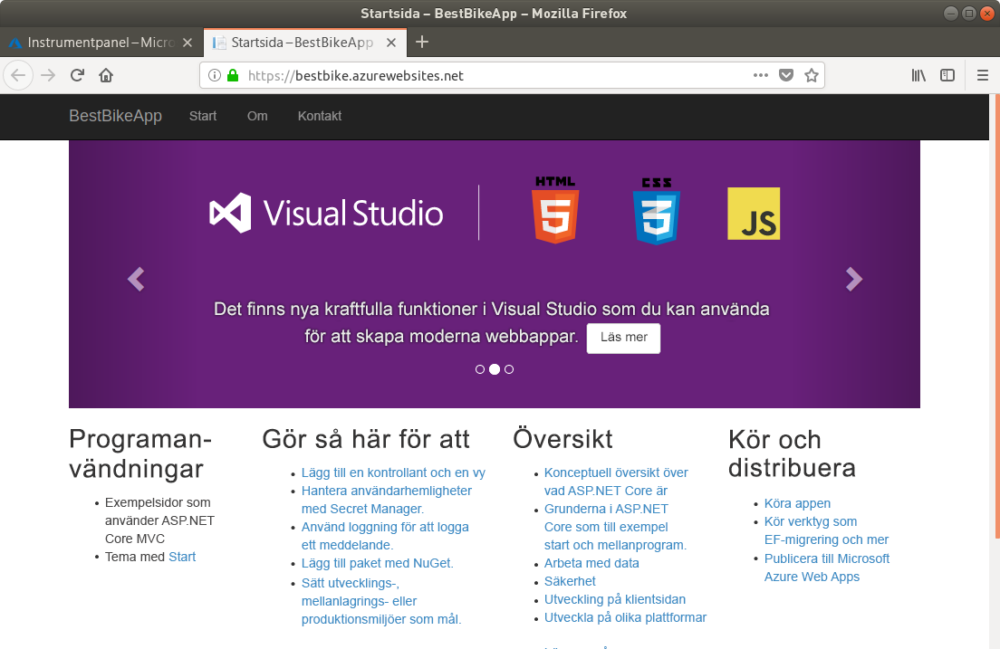
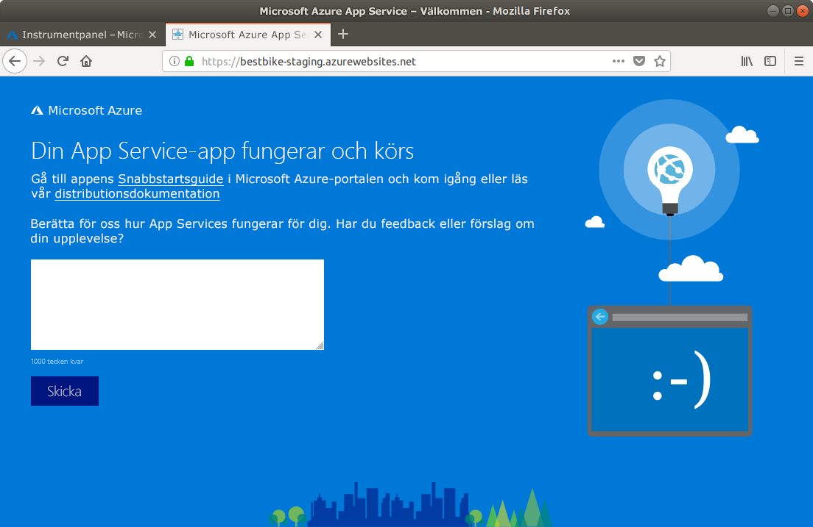

I den här enheten, måste du ladda upp din ASP.NET Core-App till Azure App Service.

## <a name="create-a-staging-deployment-slot"></a>Skapa ett distributionsfack för mellanlagring

1. Öppna den App Service-resurs (webbapp) som du skapade tidigare. Om du har stängt sidan du hittar den igen genom att söka efter appen i **alla resurser** eller den aktuella resursgruppen i **resursgrupper**.

1. Klicka på menykommandot **Distributionsfack** i det vänstra navigeringsfönstret.

1. I den **distributionsfack** klickar du på den **Lägg till plats** knappen i det övre navigeringsfältet på sidan platser för distributionen.

1. Azure-portalen öppnas den **Lägg till en plats** sidan som visas nedan.

    1. Namnge ditt distributionsfack. I det här fallet använder du `staging`.

    2. När du väljer **Konfigurationskälla** har du två alternativ.

        * Du kan välja att klona konfigurationselement från en befintlig distributionsplats eller en App Service-app.
        * Eller så kan du välja att inte klona några konfigurationselement. Välj alternativet **Klona inte konfigurationen från ett befintligt fack**.

        För det här distributionsfacket, väljer du det andra alternativet **Klona inte konfigurationen från ett befintligt fack**. Du kommer att konfigurera det direkt.

    

1. Klicka på den **OK** längst ned på sidan för att skapa din nya distributionsplats.

1. När distributionsplatsen har skapats, Azure-portalen navigerar du tillbaka till den **distributionsfack** sidan i webbappen.

    Du kan nu se det nya distributionsfacket du just skapade.

    

1. Välj det nya distributionsfacket.

1. Azure-portalen navigerar till **Översikt**-sidan för det nyligen skapade distributionsfacket.

    

    Observera **URL** för distributionsfacket för mellanlagring. Det är en annan URL från den du såg tidigare, med facknamnet sist.

    Ett distributionsfack behandlas som en fullständig App Service-app i Azure. Det är dock en särskild typ som är underordnad den ursprungliga appen och kan därför bytas mot den ursprungliga appen.

    Om du klickar på den **URL**, visas samma standardsidan som Azure skapade för distributionsplatsen ”app” första gången vi skapade den i Azure-portalen.

Nu när distributionsfacket för mellanlagring har skapats måste du konfigurera **autentiseringsuppgifter för distributionen**.

## <a name="create-deployment-credentials"></a>Skapa autentiseringsuppgifter för distribution

I Azure måste du ställa in autentiseringsuppgifter för distribution innan du kan börja den faktiska distributionsprocessen. Därför kommer du att lära dig hur du skapar dina egna autentiseringsuppgifter för distribution.

1. Klicka på menykommandot **Autentiseringsuppgifter för distribution** i det vänstra navigeringsfönstret.

1. Azure-portalen navigerar till den **autentiseringsuppgifter för distribution** sidan som visas nedan.

    Ange ett **användarnamn** och ett **lösenord** och bekräfta sedan lösenordet.

    > [!NOTE]
    > Se till att skriva ned användarnamnet och lösenordet så att du inte glömmer dem! Du behöver dem senare när vi börjar ladda upp och distribuera koden till Azure.

    

1. Klicka på den **spara** längst upp på den **autentiseringsuppgifter för distribution** sidan.

Nu när autentiseringsuppgifterna för distribution har skapats behöver du konfigurera övriga distributionsalternativ.

## <a name="use-a-local-git-repository-as-your-deployment-option"></a>Använda en lokal Git-lagringsplats som distributionsalternativ

Därefter skapar vi en lokal Git-lagringsplats i Azure så att du kan börja ladda upp din kod.

1. I den **mellanlagring** distributionsplats ”app”, klicka på den **distributionsalternativ** menyalternativ i det vänstra navigeringsfönstret.

1. Azure-portalen navigerar till den **distributionsalternativ** sidan.

1. Klicka på **Välj källa** för att konfigurera de nödvändiga inställningarna.

1. Azure-portalen visar de tillgängliga alternativen som du kan konfigurera och använda. I vårt fall väljer du alternativet **Lokal Git-lagringsplats**.

1. Du kommer tillbaka till den **distributionsalternativet** sidan. Klicka på den **OK** längst ned på sidan för att konfigurera någon distributionskälla.

1. Navigera nu till avsnittet **Distributionscenter (förhandsversion)** till vänster för att visa den nya distributionsinformationen.

    

    Viktig information att notera här är den **Uri för Git-klon**, som är lokala Git-lagringsplats-URL som du vill använda som en **remote** för lagringsplatsen för din lokala program.

Det är dags att börja ladda upp kod till ett distributionsfack för mellanlagring.

## <a name="install-git-on-your-machine"></a>Installera Git på datorn

Om du inte redan har gjort det, installerar du Git på din Linux-dator.

> [!NOTE]
> De här instruktionerna är för Ubuntu 18.04 så stegen för att installera Git kan skilja sig för din distribution och version. Ta en titt på [Linux Git Installationsinstruktioner](https://git-scm.com/download/linux) för de steg som krävs.

1. Öppna ett nytt **terminalfönster**

1. Ange följande kommando. Du uppmanas att ange ditt Ubuntu-användarlösenord.

    ```console
    sudo apt-get update
    ```

1. När uppdateringen är färdig anger du följande kommando för att installera Git lokalt. Du uppmanas att godkänna installationen av Git på din dator.

    ```console
    sudo apt-get install git-core
    ```

1. För att kontrollera att Git är installerat anger du följande kommando:

    ```console
    git --version
    ```

   Om installationen lyckas visas följande utdata:

    ```console
    git version 2.17.1
    ```

1. Det är alltid en bra idé att konfigurera Git-inställningar genom att ange namn och e-postadress. För att göra det så behöver du utfärda följande kommandon, där du ersätter platshållarna `{your name}` och `{your email}` med ditt eget namn och e-postadress (utan `{}` klammerparanteserna):

    ```console
    git config --global user.name "{your name}"
    git config --global user.email "{your email}"
    ```

1. För att verifiera att din information har registrerats av Git anger du följande kommando:

    ```console
    cat ~/.gitconfig
    ```

   Du bör se följande utdata med ditt namn och din e-postadress:

    ```console
    [user]
        name = {your name}
        email = {your email}
    ```

## <a name="initialize-a-local-git-repository-for-your-code"></a>Initiera en lokal Git-lagringsplats för din kod

Om du vill börja använda Git, måste du initiera en lokal Git-lagringsplats för din programkod i .NET Core.

1. Öppna ett nytt **terminalfönster**.

1. Navigera till rotmappen innehåll för .NET Core-app som du skapade tidigare. Du kan skriva så här:

    ```console
    cd ~/Documents/BestBikeApp/
    ```

1. Initiera en ny Git-lagringsplats genom att ange följande kommando:

    ```console
    git init
    ```

    Om kommandot lyckas visas ett meddelande som ser ut så här:

    ```console
    Initialized empty Git repository in /home/{your-user}/Documents/BestBikeApp/.git/
    ```

1. Mellanlagra programfiler till Git.

   Nästa steg är att låta Git veta om dina filer. Det gör du genom att lägga till alla filer i arbetskatalogen så att de **mellanlagras** av Git. Ange följande kommando:

    ```console
    git add .
    ```

    När du anger ”.” i kommandot ovan läggs alla filer till för mellanlagring i Git.

1. Nu behöver du checka in ändringarna i Git.

   När du mellanlagrar filerna med Git behöver du checka in filerna i den lokala **Git-incheckningshistoriken**. Det gör du med följande kommando:

    ```console
   git commit -m "Initial create"
    ```

   Kommandot `commit` kan ta argumentet `-m` med ett meddelande om incheckningen du skapar. När du senare överför koden till Azure kan du se samma meddelande för just den här incheckningen.

## <a name="add-a-remote-for-the-local-git-repository"></a>Lägga till en fjärranslutning till den lokala Git-lagringsplatsen

Hittills har du initierat en ny lokal Git-lagringsplats. Du har dessutom åtagit alla dina filer till Git. Det som återstår är att lägga till en **fjärranslutning** som ansluter din lokala Git-lagringsplats till den som hanteras i Azure.

För att göra det behöver du:

1. Kopiera den **Git-klon-URL** som du såg ovan.

1. När den har kopierats går du tillbaka till **terminalfönstret** och anger följande Git-kommando:

    ```console
    git remote add origin https://BESTBIKE-git@BESTBIKE-staging.scm.azurewebsites.net:443/BESTBIKE.git
    ```

    Git-kommandot ovan kopplar din lokala Git-lagringsplats till den som hanteras i Azure. Nu kan du börja skicka och hämta mellan den lokala och den fjärranslutna Git-lagringsplatsen!

1. Verifiera ovanstående kommando genom att ange följande Git-kommando:

    ```console
    git remote -v
    ```

    Ovanstående kommando genererar följande utdata:

    ```console
    origin  https://BESTBIKE-git@BESTBIKE-staging.scm.azurewebsites.net:443/BESTBIKE.git (fetch)
    origin  https://BESTBIKE-git@BESTBIKE-staging.scm.azurewebsites.net:443/BESTBIKE.git (push)
    ```

## <a name="push-your-code-to-azure"></a>Skicka koden till Azure

Nu när du har din lokala Git-lagringsplats som kopplas till Git-lagringsplatsen i Azure kommer du utvecklar och skapa appen och skicka sedan din programkod till Azure.

1. Skriv följande Git-kommando för att skicka din **huvudgren** till den fjärranslutna Git-lagringsplatsen i Azure:

    ```console
    git push origin master
    ```

1. Du får ange lösenordet du konfigurerade i avsnittet **Autentiseringsuppgifter för distribution** ovan. Ange lösenordet och tryck på Retur. Git börjar överföra dina incheckade filer till den fjärranslutna Git-lagringsplatsen i Azure som konfigurerats under distributionsfacket för mellanlagring.

## <a name="verify-the-code-is-uploaded-to-azure"></a>Kontrollera koden har laddats upp till Azure

1. Logga in på Azure-portalen.

1. Klicka på menykommandot **Alla resurser** i det vänstra navigeringsfönstret.

1. Azure-portalen navigerar till listan över alla resurser som skapats på Azure hittills.

1. Klicka på det mellanlagringsfack som skapades ovan. Kom ihåg att en distributionsplats betraktas som en app och därför visas den som en App Service-resurs under **alla resurser**.

1. När du kommer till sidan fack för mellanlagringsplatser distribution går du till **distributionsalternativ**.

    Du kommer att se att din första incheckning som du har lokalt på datorn nu har laddats upp till Azure-portalen.

    När du har överfört din kod lokalt till Git-lagringsplatsen i App Service, registrerar Azure den här åtgärden.

    Varje gång du skickar kod till Azure så visas en ny post tillsammans med meddelandet du angav när du checkade in ändringarna lokalt.

    

1. Vi går till webbadressen för **mellanlagringsfacket**. URL:en nämndes ovan, men om du glömmer den så kan du alltid gå till sidan **Översikt** i distributionsfacket för mellanlagring och hämta URL:en.

1. Ange följande URL i webbläsarens adressfält: [https://BESTBIKE-staging.azurewebsites.net/](https://BESTBIKE-staging.azurewebsites.net/).

    

Du har laddats upp dina lokala filer till en mellanlagringsplats för distribution på Azure.

## <a name="swapping-the-staging-and-production-deployment-slots"></a>Växla mellan distributionsfack för mellanlagring och produktion

Nu när programmet är igång och körs i distributionsfacket för mellanlagring som hanteras i Azure är det dags att växla till produktionsfacket. Det gör du så här:

1. Gå till sidan för ursprungliga skapade tidigare. Du kan hitta den ursprungliga webbappen från den **alla resurser** sidan.

1. Klicka på menykommandot **Distributionsfack** i det vänstra navigeringsfönstret.

1. Klicka på den **växla** längst upp på sidan.

1. Azure-portalen navigerar du till den **växla** sidan.

1. I fältet **Växla** väljer du **Växla**.

1. I fältet **Källa** väljer du **Mellanlagring**.

1. I fältet **Mål** väljer du **Produktion**.

    

1. Klicka på den **OK** längst ned på sidan.

1. Azure startar växlingsprocessen. Den här åtgärden tar vanligtvis några sekunder beroende på hur stor webbappen som växlas är.

1. När åtgärden är klar går du till webbappens URL: [https://bestbike.azurewebsites.net/](https://bestbike.azurewebsites.net/).

    

    Växlingsåtgärden är nu klar! Du kan nu se att den kod som du överförde till distributionsfacket för mellanlagring även finns på produktionsfacket.

1. Besök nu URL:en för mellanlagringsfacket: [https://bestbike-staging.azurewebsites.net/](https://bestbike-staging.azurewebsites.net/).

    

    Mellanlagringsplatsen distributionen fungerar nu ursprungliga standard HTML-filer som tidigare har hämtats från produktionsplatsen.

Grattis! Du har överfört din programkod till Azure och växlas distributionsplatser.
