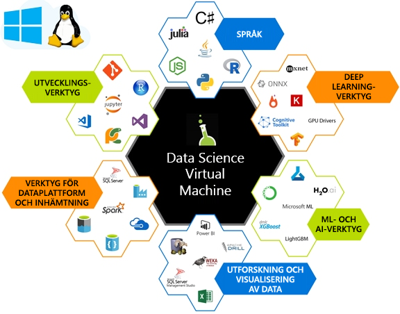

## Introduktion till djupinlärningIntro to deep learning

Målet med Machine Learning (ML) är att hitta funktioner för att ta fram en modell som omvandlar indata (t.ex. bilder, tidsserier eller ljud) till vissa utdata (t.ex. bildtexter, prisvärden, transkriptioner).The goal of Machine Learning ML is to find features to train a model that transforms input data (such as pictures, time series, or audio) to a given output (for example captions, price values, transcriptions). I traditionella datavetenskap handplockas funktionerna ofta.In traditional data science, features are often hand-picked.

I Deep Learning (DL) är funktionsextraheringen en process som lärs in genom att indata representeras som vektorer och transformeras med ett antal smarta linjära algebraåtgärder till givna utdata.In Deep Learning (DL), the process of feature extraction is learned through representing inputs as vectors and transforming them, with a series of clever linear algebra operations, into a given output.  

Modellutdata jämförs sedan med förväntade utdata med hjälp av en förlustfunktionsekvation.The model output is then compared against the expected output using an equation called a loss function. Värdet som returneras av förlustfunktionen för respektive utbildnings indata används för att hjälpa modellen att extrahera funktioner som resulterar i ett lägre förlustvärde nästa pass.The value returned by the loss function of each training input is used to guide the model to extract features that will result in a lower loss value on the next pass.  
 
Den serie av matrisåtgärder som vi beräknar som en del av den linjära algebrakomponenten tenderar att vara beräkningsmässigt expansiv och är ofta tungt parallelliserbar, vilket kräver specialiserad databearbetning, t.ex. grafikprocessorer, för att kunna beräkna effektivt.The series of matrix operations that we computer as part of the linear algebra component tend to be computationally expensive and are often heavily parallelizable, requiring specialized compute such as Graphics Processing Units GPUs to compute efficiently.

## Data Science Virtual MachineData Science Virtual Machine

DSVM:er är Azure Virtual Machine-avbilder som har förinstallerats, konfigurerats och testats med flera populära verktyg som vanligen används för dataanalys, maskininlärning och utbildning inom djupinlärning.DSVMs are Azure Virtual Machine images, pre-installed, configured, and tested with several popular tools that are commonly used for data analytics, machine learning, and deep learning training.

De tillhandahåller:They provide:

- Enhetlig installation mellan team, vilket underlättar delning och samarbete, skalning och hantering i Azure, minimal konfigurering, helt molnbaserat skrivbord för datavetenskap.Consistent setup across team, promote sharing and collaboration, Azure scale and management, Near-Zero Setup, full cloud-based desktop for data science.
- Elastisk kapacitet på begäran med möjlighet att köra analyser på alla Azure-maskinvarukonfigurationer med vertikal och horisontell skalning.On-demand elastic capacity Ability to run analytics on all Azure hardware configurations with vertical and horizontal scaling. Betala endast för det du använder, och när du använder det.Pay only for what you use, when you use it.
- Djupinlärning med GPU:er, lättillgängliga GPU-kluster med förkonfigurerade djupinlärningsverktyg.Deep Learning with GPUs Readily available GPU clusters with Deep Learning tools already pre-configured. 

DSVM innehåller flera AI-verktyg, t.ex. populära GPU-versioner av djupinlärningsramverk och verktyg som Microsoft R Server Developer Edition, Anaconda Python, Jupyter-anteckningsböcker för Python och R, IDE:er för Python och R, SQL-databaser och många andra verktyg för datavetenskap och ML.The DSVM contains several tools for AI including popular GPU editions of deep learning frameworks and tools such as Microsoft R Server Developer Edition, Anaconda Python, Jupyter notebooks for Python and R, IDEs for Python and R, SQL database and many other data science and ML tools.

DSVM kan köras på VM-instanser i Azure GPU NC-serien.The DSVM can run on Azure GPU NC-series VM instances. Dessa GPU:er använder diskret enhetstilldelning, vilket resulterar i Bare Metal-liknande prestanda och som väl lämpar sig för djupinlärningsproblem.These GPUs use discrete device assignment, resulting in performance close to bare-metal, and are well-suited to deep learning problems.

<!--### Quiz? 

What is the goal of machine learning? 
How is traditional machine learning different from deep learning? 
Why are GPU's often used for deep learning? 
What does the DSVM provide? -->
