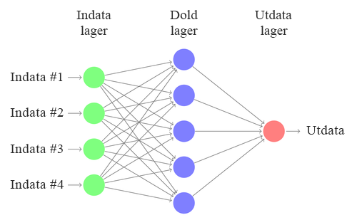

Målet med maskininlärning är att hitta funktioner för att ta fram en modell som omvandlar indata (t.ex. bilder, tidsserier eller ljud) till vissa utdata (t.ex. bildtexter, prisvärden, transkriptioner). I traditionella datavetenskap förs funktionerna ofta för hand. Dessa handgjorda funktioner matas in i en grund inlärningsalgoritm, till exempel nätverket som visas i följande diagram. 

Inom djupinlärning är funktionsextraheringen en process som lärs in genom att indata representeras som vektorer och transformeras med ett antal smarta linjära algebraåtgärder till givna utdata.  Modellutdata jämförs med förväntade utdata med hjälp av en förlustfunktionsekvation. Värdet som returneras av förlustfunktionen för respektive utbildnings indata används för att hjälpa modellen att extrahera funktioner som resulterar i ett lägre förlustvärde nästa pass. Processen kallas för *träning*. 

Genom träning kan dess algoritmer lära sig vilka funktioner som presterar bäst och är mest lämpliga för den givna datamängden. De kallas för djupa på grund av antalet lager i nätverket.  

De matrisåtgärder som vi beräknar som en dela av den linjära algebrakomponenten är beräkningsmässigt dyra. Dessa åtgärder kan ofta bearbetas parallellt, vilket göra dem till bra kandidater för specialiserade beräkningar, till exempel grafiska processorer (GPU) för att beräkna effektivt.

Det är inte helt enkelt att konfigurera en miljö för djupinlärning. Hur ska maskinvaran konfigureras, måste du träna modellen med processorer eller grafikprocessorer och hur mycket minne ska datorerna ha? Om du vill skapa och träna ett djupinlärningsnätverk måste du installera rätt programvara. Du har många djupinlärningsramverk att välja mellan men du måste vara uppmärksam på beroenden mellan varje komponent. När allt detta är konfigurerat kanske du hittar en bra modell som skapats på ett annat ramverk och vill prova det. Du vill slippa omkostnaden för att skaffa ett nytt djupinlärningsramverk med alla dess beroenden konfigurerade på din dator. Med Data Science Virtual Machine kan du lösa dess problem. 

## Vad är Data Science Virtual Machine (DSVM)?

Data Science Virtual Machine är en virtuell dator-avbildning på Azure. Den har många populära datavetenskaps- och djupinlärningsverktyg installerade och konfigurerade. Dessa avbildningar levereras med populära datavetenskaps- och maskininlärningsverktyg, som Microsoft R Server Developer Edition, Microsoft R Open, Anaconda Python, Julia, Jupyter-anteckningsböcker, Visual Studio Code, RStudio, xgboost och många fler.  I stället för att distribuera en jämförbar arbetsyta på egen hand kan du etablera en DSVM – och på så sätt spara mycket tid på installation, konfiguration och pakethanteringsprocesser. När din DSVM har distribuerats kan du omedelbart börja arbeta med ditt datavetenskapsprojekt.

DSVM kan användas till att träna modeller med hjälp av djupinlärningsalgoritmer på maskinvara för grafikprocessorer (GPU). Genom att utnyttja Azure-molnets VM-skalningsfunktioner hjälper DSVM dig att använda GPU-baserad maskinvara i molnet enligt behov. Du kan växla till en GPU-baserad virtuell dator vid utbildning av stora modeller eller behov av snabba beräkningar samtidigt som samma OS-disk behålls. Windows Server 2016-versionen av DSVM levereras förinstallerad med GPU-drivrutiner, -ramverk och GPU-versioner av djupinlärningsramverk. I Linux är djupinlärning på GPU aktiverat på DSVM för både CentOS och Ubuntu. Du kan även distribuera Ubuntu-, CentOS- eller Windows 2016-versionen av den virtuella datorn för datavetenskap till icke CPU-baserade virtuella Azure-datorer. Då återställs alla djupinlärningsramverk till CPU-läget. 

Mer information om vad du kan göra med en DSVM finns i [Data science with a Linux Data Science Virtual Machine on Azure](https://docs.microsoft.com/azure/machine-learning/data-science-virtual-machine/linux-dsvm-walkthrough) (Datavetenskap med en Linux Data Science Virtual Machine på Azure)

