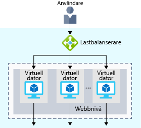
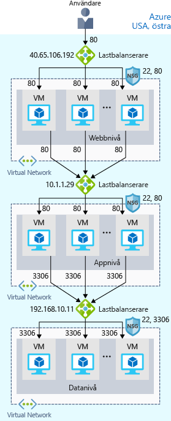

Nu är din webbplats igång på Azure.You now have your site up and running on Azure. Men hur kan du se till att din webbplats alltid är igång?But how can you help ensure your site is running 24/7?

Vad händer till exempel när du behöver utföra veckounderhåll?For instance, what happens when you need to do weekly maintenance? Tjänsten kommer fortfarande att vara otillgänglig under underhållsperioden.Your service will still be unavailable during your maintenance window. Och eftersom webbplatsen når användare över hela världen finns det ingen bra tidpunkt att ta ned systemen för underhåll.And because your site reaches users all over the world, there's no good time to take down your systems for maintenance. Du kan också stöta på prestandaproblem om för många användare ansluter samtidigt.You may also run into performance issues if too many users connect at the same time.

## Vad är tillgänglighet och hög tillgänglighet?What are availability and high availability?

:::row:::
  :::column:::
    
  :::column-end:::
    :::column span="3"::: _Tillgänglighet_ innebär hur länge tjänsten är igång utan avbrott.:::column span="3"::: _Availability_ refers to how long your service is up and running without interruption. _Hög tillgänglighet_ eller _högt tillgänglig_ avser en tjänst som är igång under lång tid._High availability_, or _highly available_, refers to a service that's up and running for a long period of time.

Du vet hur frustrerande det är när du inte kommer åt den information du behöver.You know how frustrating it is when you can't access the information you need. Tänk på en webbplats för sociala medier eller nyheter som du besöker dagligen.Think of a social media or news site that you visit daily. Kommer du alltid åt webbplatsen eller visas ofta felmeddelanden, till exempel ”503 – tjänsten är inte tillgänglig”?Can you always access the site, or do you often see error messages like "503 Service Unavailable"?
  :::column-end:::
 :::row-end:::

Du kanske har hört uttryck som ”five nines”-tillgänglighet.You may have heard terms like "five nines availability." ”Five nines” (fem nior) innebär att tjänsten garanterat är igång 99,999 procent av tiden.Five nines availability means that the service is guaranteed to be running 99.999 percent of the time. Det är svårt att uppnå 100 procent tillgänglighet, men många team strävar efter minst fem nior.Although it's difficult to achieve 100 percent availability, many teams strive for at least five nines.

## Vad är återhämtning?What is resiliency?

:::row:::
  :::column:::
    
  :::column-end:::
    :::column span="3"::: _Återhämtning_ avser ett systems förmåga att fortsätta att fungera under avvikande förhållanden.:::column span="3"::: _Resiliency_ refers to a system's ability to stay operational during abnormal conditions.

Exempel på sådana förhållanden:These conditions include:

- Naturkatastrofer.Natural disasters.
- Systemunderhåll, både planerat och oplanerat, bland annat programuppdateringar och säkerhetskorrigeringar.System maintenance, both planned and unplanned, including software updates and security patches.
- Toppar i trafiken på webbplatsen.Spikes in traffic to your site.
- Hot från parter med ont uppsåt, till exempel distribuerade överbelastningsattacker (DDoS).Threats made by malicious parties, such as distributed denial of service, or DDoS, attacks.
  :::column-end:::
:::row-end:::

Tänk dig att marknadsavdelningen vill ha en blixtrea för att marknadsföra en ny serie vitamintillskott.Imagine your marketing team wants to have a flash sale to promote a new line of vitamin supplements. Du kan förvänta dig en hög topp i trafiken under den här tiden.You might expect a huge spike in traffic during this time. Den här toppen kan överbelasta bearbetningssystemet, så att det blir långsamt eller stannar helt och dina användare blir besvikna.This spike could overwhelm your processing system, causing it to slow down or halt, disappointing your users. Du kan ha upplevt den här besvikelsen själv.You may have experienced this disappointment for yourself. Har du någonsin försökt komma åt en onlinerea och upplevt att webbplatsen inte svarar?Have you ever tried to access an online sale only to find the website wasn't responding?

## Vad är en lastbalanserare?What is a load balancer?

:::row:::
  :::column:::
    
  :::column-end:::
    :::column span="3"::: En _lastbalanserare_ distribuerar trafik jämt mellan alla system i en pool.:::column span="3"::: A _load balancer_ distributes traffic evenly among each system in a pool. Med hjälp av en lastbalanserare kan du uppnå både hög tillgänglighet och återhämtning.A load balancer can help you achieve both high availability and resiliency.

Anta att du börjar med att lägga till ytterligare virtuella datorer, med identisk konfiguration, på varje nivå.Say you start by adding additional VMs, each configured identically, to each tier. Tanken är att ha ytterligare system som är redo om ett blir otillgängligt eller hanterar för många användare samtidigt.The idea is to have additional systems ready, in case one goes down or is serving too many users at the same time.
  :::column-end:::
:::row-end:::

Problemet här är att varje virtuell dator har en egen IP-adress.The problem here is that each VM would have its own IP address. Dessutom går det inte att distribuera trafik om ett system blir otillgängligt eller är upptaget.Plus, you don't have a way to distribute traffic in case one system goes down or is busy. Hur kopplar du samman de virtuella datorerna så att de visas som ett enda system för användaren?How do you connect your VMs so that they appear to the user as one system?

Lösningen är att använda en belastningsutjämnare för att distribuera trafik.The answer is to use a load balancer to distribute traffic. Belastningsutjämnaren blir användarens startpunkt.The load balancer becomes the entry point to the user. Användaren vet inte (och behöver inte veta) vilket system lastbalanseraren väljer för att ta emot begäran.The user doesn't know (or need to know) which system the load balancer chooses to receive the request.

Här är en bild som visar rollen för en lastbalanserare.The following illustration shows the role of a load balancer.

Du ser att lastbalanseraren tar emot användarens begäran.You see that the load balancer receives the user's request. Belastningsutjämnaren dirigerar begäran till någon av de virtuella datorerna på webbnivån.The load balancer directs the request to one of the VMs in the web tier. Om en virtuell dator inte är tillgänglig eller inte svarar slutar belastningsutjämnaren att skicka trafik till den.If a VM is unavailable or stops responding, the load balancer stops sending traffic to it. Belastningsutjämnaren dirigerar sedan trafik till en av de tillgängliga servrarna.The load balancer then directs traffic to one of the responsive servers.

Med hjälp av belastningsutjämning kan du köra underhållsuppgifter utan att avbryta tjänsten.Load balancing enables you to run maintenance tasks without interrupting service. Du kan exempelvis sprida ut underhållsperioden för alla virtuella datorer.For example, you can stagger the maintenance window for each VM. Under underhållsperioden känner belastningsutjämnaren av att den virtuella datorn inte svarar och dirigerar trafik till andra virtuella datorer i poolen.During the maintenance window, the load balancer detects that the VM is unresponsive, and directs traffic to other VMs in the pool.

För din näthandelswebbplats kan app- och datanivåerna också ha en belastningsutjämnare.For your e-commerce site, the app and data tiers can also have a load balancer. Det beror helt på vad tjänsten kräver.It all depends on what your service requires.

## Vad är Azure Load Balancer?What is Azure Load Balancer?

Azure Load Balancer är en tjänst för lastbalansering som Microsoft tillhandahåller vilken hjälper att ta hand om underhållet åt dig.Azure Load Balancer is a load balancer service that Microsoft provides that helps take care of the maintenance for you.

När du manuellt konfigurerar normal programvara för belastningsutjämning på en virtuell dator finns det en nackdel: nu har du ytterligare ett system som du behöver underhålla.When you manually configure typical load balancer software on a virtual machine, there's a downside: you now have an additional system that you need to maintain. Om lastbalanseraren blir otillgänglig eller kräver rutinunderhåll kommer du tillbaka till det ursprungliga problemet.If your load balancer goes down or needs routine maintenance, you're back to your original problem.

Om du istället använder Azure Load Balancer så finns det ingen infrastruktur eller programvara att underhålla.If instead, however, you use Azure Load Balancer, there's no infrastructure or software for you to maintain.

Följande bild visar rollen för Azure-lastbalanserare i en arkitektur med flera nivåer.The following illustration shows  the role of Azure load balancers in a multi-tier architecture.

## Hur är det med DNS?What about DNS?

:::row:::
  :::column:::
    
  :::column-end:::
    :::column span="3"::: DNS, eller Domain Name System, är ett sätt att mappa användarvänliga namn till sina IP-adresser.:::column span="3"::: DNS, or Domain Name System, is a way to map user-friendly names to their IP addresses. Du kan tänka dig DNS som Internets telefonkatalog.You can think of DNS as the phonebook of the internet.

Domännamnet contoso.com kan till exempel mappas till belastningsutjämnarens IP-adress på webbnivå, 40.65.106.192.For example, your domain name, contoso.com, might map to the IP address of the load balancer at the web tier, 40.65.106.192.

Du kan ta med din egen DNS-server eller använda Azure DNS, en värdtjänst för DNS-domäner som körs på Azure-infrastruktur.You can bring your own DNS server or use Azure DNS, a hosting service for DNS domains that runs on Azure infrastructure.
  :::column-end:::
:::row-end:::

Följande bild visar Azure DNS.The following illustration shows Azure DNS. När användaren navigerar till contoso.com dirigerar Azure DNS trafik till lastbalanseraren.When the user navigates to contoso.com, Azure DNS routes traffic to the load balancer.

## SammanfattningSummary

Med belastningsutjämning har din näthandelswebbplats nu högre tillgänglighet och återhämtning.With load balancing in place, your e-commerce site is now more highly available and resilient. När du utför underhåll eller när trafiken ökar tillfälligt kan belastningsutjämnaren distribuera trafik till ett annat tillgängligt system.When you perform maintenance or receive an uptick in traffic, your load balancer can distribute traffic to another available system.

Du kan konfigurera en egen belastningsutjämnare på en virtuell dator, men Azure Load Balancer minskar behovet av underhåll eftersom det inte finns någon infrastruktur eller programvara att underhålla.Although you can configure your own load balancer on a VM, Azure Load Balancer reduces upkeep because there's no infrastructure or software to maintain.

DNS mappar användarvänliga namn till deras IP-adresser, ungefär som en telefonkatalog mappar namn på personer och företag till telefonnummer.DNS maps user-friendly names to their IP addresses, much like how a phonebook maps names of people or businesses to phone numbers. Du kan ta med en egen DNS-server eller använda Azure DNS.You can bring your own DNS server, or use Azure DNS.
