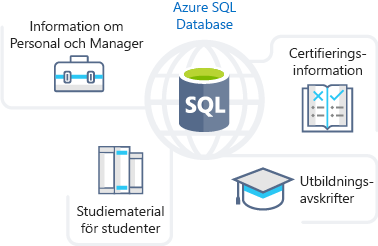

Titta på fördelarna med Azure datalagring, förstår du att den erbjuder de bästa alternativen för att lagra din learning portal. Nu ska vi Utforska fördelarna och alternativ i detalj för att se hur den passar dina affärsbehov.

## Hur Azure datalagring kan uppfylla dina affärsbehov för lagring

Azure tillhandahåller flera lagringsalternativ som är anpassad till specifika typer av datalagring.

### Azure SQL Database

**Azure SQL Database** en robust, helt hanterad relationsdatabas molndatabas. Du kan använda den här funktionen till att lagra data som du använder och uppdaterar ofta, till exempel personlig och utbildningsrelaterad information om din personal. Du kan också migrera befintliga SQL Server-databaser utan att ändra dina program. Följande bild visar typerna av data från utbildning online portal scenariot som lagras i en Azure SQL database.

### Azure Cosmos DB

Azure Cosmos DB är en globalt distribuerad databastjänst. Den stöder schemalösa-data som kan du skapa högtillgängliga och *Always On* programmen stöd för ständigt föränderliga data. Du kan använda den här funktionen för att lagra data som uppdateras och underhålls av användare i hela världen. I följande illustration visas en exempeldatabas för Azure Cosmos DB som används för att lagra data som används av flera personer som finns över hela världen.

### Azure Blob Storage

Azure Blob storage kan du stora stream-video eller ljud filer direkt till användarens webbläsare från var som helst i världen. Blob Storage används också till att lagra data för säkerhetskopiering och återställning, haveriberedskap och arkivering. Azure Blob Storage kan lagra upp till 8 TB data för virtuella datorer. Följande bild visar ett exempel på användning av Azure blob-lagring.

### Azure Data Lake Storage Gen2

Data Lake-funktionen kan du utföra analyser på din dataanvändning och förbereda rapporter. Data Lake är en stor databas för både strukturerade och ostrukturerade data.

**Azure Data Lake Storage Gen2** kombinerar objektlagringens skalbarhet och kostnadsfördelar med Big Data-filsystemens tillförlitlighet och prestanda. Följande bild visar hur Azure Data Lake lagrar dina affärsdata och gör dem tillgängliga för analys.

### Azure Files

Med Azure Files får du helt hanterade filresurser i molnet. Program som körs i Azure kan enkelt dela filer mellan virtuella datorer. Du kan använda Azure-filresurser på samma gång för molnet eller lokala distributioner av Windows, Linux och macOS. Följande bild visar Azure-filer som används för att dela data mellan två geografiska platser. Azure Files använder protokollet Server Message Block (SMB), vilket garanterar att data krypteras i vila och under överföring.

### Azure Queue

Azure Queue Storage är en tjänst för lagring av stora mängder meddelanden som kan nås var som helst i världen. Ett enskilt kömeddelande har en storlek på upp till 64 kB och en kö kan innehålla flera miljoner meddelanden.

Det är oftast en eller flera komponenter av avsändaren och komponenter för en eller flera mottagare. Avsändarkomponenterna lägger till meddelande i kön. Mottagarkomponenter hämtar meddelanden som ligger först i kön för bearbetning. Följande bild visar flera avsändarappar som lägger till meddelanden i Azure-kön och en mottagarapp som hämtar meddelandena.

Queue Storage används främst för följande:

- För att skapa en lista med kvarvarande arbetsuppgifter och för att skicka meddelanden mellan olika Azure-webbservrar.
- För att belastningsutjämna mellan olika webbservrar/infrastrukturer och hantera trafiktoppar.
- För att säkerställa återhämtning efter komponentfel när flera personer använder dina data samtidigt.

### Azure Standard Storage

Virtuella datorer i Azure använder diskar till att lagra operativsystem, program och data. Azure Standard Storage ger ett tillförlitligt och kostnadseffektivt diskstöd för virtuella datorer som kör arbetsbelastningar som inte är verksamhetskritiska. Med Standard Storage lagras data på hårddiskar (HDD).

När du arbetar med virtuella datorer kan du använda SSD-standarddiskar och HDD-standarddiskar för mindre kritiska arbetsbelastningar, och SSD-premiumdiskar för verksamhetskritiska produktionsprogram. Azures diskar har konsekvent levererat tillförlitlighet i företagsklass, med en branschledande årlig felfrekvens på 0 %. Följande bild visar en Azure virtuell dator som använder separata diskar för att lagra andra data.

### Lagringsnivåer

Azure erbjuder tre lagringsnivåer för lagring av blob-objekt:

1. **Frekvent lagringsnivå**: optimerad för att lagra data som används ofta. 

1. **Lågfrekvent lagringsnivå**: optimerad för data som används sällan och som lagras i minst 30 dagar.

1. **Arkivlagringsnivån**: för data som används sällan och som lagras i minst 180 dagar med flexibla svarstidskrav.

### Kryptering/replikering

Azure tillhandahåller säkerhet och hög tillgänglighet till dina data via funktioner för kryptering och replikering.

#### Kryptering för lagringstjänster

Följande krypteringstyper är tillgängliga för dina resurser:

1. **Azure Storage Service Encryption (SSE)** för data i vila hjälper dig att skydda dina data på ett sätt som uppfyller organisationens krav på säkerhet och regelefterlevnad. Azure SSE krypterar data innan de lagras och dekrypterar data innan de hämtas. Krypteringen och dekrypteringen är transparent för användaren.

1. **Kryptering på klientsidan** är när data redan har krypterats av klientbiblioteken. Azure lagrar data i krypterat tillstånd i vila och dekrypterar sedan när data hämtas.

#### Replikering för tillgänglighet

Replikeringstypen ställs in när du skapar ett lagringskonto. Replikeringsfunktionen garanterar att dina data alltid är tillgängliga. Azure tillhandahåller regionala och geografiska replikeringar för att skydda dina data mot naturkatastrofer och andra lokala katastrofer som fire eller överbelasta.