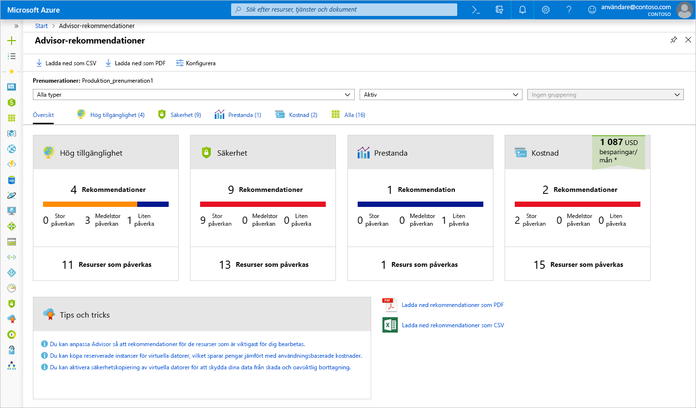
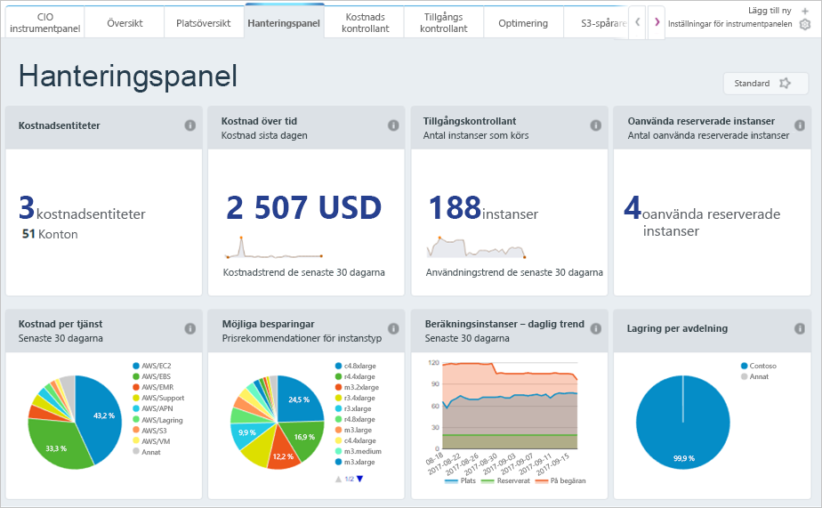

Vi har lärt oss hur du uppskattar dina kostnader innan du distribuerar tjänster i Azure, men hur gör du med resurser som redan har distribuerats? Hur kan du få insyn i de kostnader du redan ådrar dig? Om vi hade distribuerat den tidigare lösningen till Azure, hur kan vi då se till att de virtuella datorerna har rätt storlek och se hur stor fakturan kommer att bli? Nu ska vi titta på några verktyg i Azure som kan lösa det här problemet.

## Vad är Azure Advisor?

**Azure Advisor** är en kostnadsfri tjänst i Azure som ger rekommendationer om hög tillgänglighet, säkerhet, prestanda och kostnader. Advisor analyserar dina distribuerade tjänster och söker efter sätt att optimera miljön med avseende på de här områdena. Här fokuserar vi på kostnadsrekommendationer, men du bör även ta en titt på de andra rekommendationerna.

Advisor ger kostnadsrekommendationer inom följande områden:

1. **Minska kostnaderna genom att eliminera avetablerade Azure ExpressRoute-kretsar.**
    Den här processen identifierar ExpressRoute-kretsar som haft providerstatusen *Inte etablerad* i mer än en månad, och du rekommenderas att ta bort kretsen om du inte planerar att etablera den hos din anslutningsprovider.

1. **Köpa reserverade instanser, vilket sparar pengar jämfört med användningsbaserad betalning.**
    Den här processen granskar din användning av virtuella datorer under de senaste 30 dagarna i syfte att se om du kan spara pengar i framtiden genom att köpa reserverade instanser. Advisor visar i vilka regioner och för vilka storlekar du potentiellt kan spara mest pengar, samt hur mycket du skulle kunna spara genom att köpa reserverade instanser.

1. **Ange rätt storlek för eller stänga ner underutnyttjade virtuella datorer.**
    Den här processen övervakar din användning av virtuella datorer under 14 dagar och identifierar de datorer som används lite. Virtuella datorer vars genomsnittliga processoranvändning är 5 % eller mindre och vars nätverksanvändning är 7 MB eller mindre under minst fyra dagar anses vara virtuella datorer med låg användning. Tröskelvärdet för genomsnittlig processoranvändning kan justeras upp till 20 procent. När du har identifierat de här virtuella datorerna kan du bestämma dig för att ändra storlek på dem vilket minskar dina kostnader.

[!include]

Nu ska vi se var du hittar Azure Advisor i portalen. 

1. Logga in på [Azure-portalen](https://portal.azure.com?azure-portal=true) med ditt Microsoft-konto. 

1. Klicka på **Alla tjänster**. I kategorin **Hanteringsverktyg** ser du **Advisor**. Du kan också skriva `Advisor` i filtreringsrutan så att du bara filtrerar på just den tjänsten.

1. Om du klickar på Advisor visas instrumentpanelen för Advisor-rekommendationer där du kan se alla rekommendationer för din prenumeration. Du ser en ruta för varje kategori med rekommendationer.

> [!NOTE]
> Du kanske inte har några rekommendationer kring kostnader i Advisor. Det här kan bero på att utvärderingarna inte är färdiga ännu, eller helt enkelt på att Advisor inte har några rekommendationer att ge.

När du klickar på **Kostnad** visas detaljerad information om rekommendationerna i Advisor.

Om du klickar på en rekommendation visas detaljerad information om rekommendationen i fråga. Sedan kan du utföra en specifik åtgärd, till exempel minska kostnaderna genom att ändra storlek på virtuella datorer.

De här rekommendationerna gäller områden där du kanske spenderar pengar ineffektivt. De är ett bra ställe att börja och komma tillbaka till när du letar efter sätt att minska dina kostnader. I vårt exempel kan vi spara ungefär 700 dollar per månad genom att följa rekommendationerna. Sådana besparingar blir betydande med tiden, så gör det till en vana att kontrollera rekommendationerna inom alla fyra områden regelbundet.

## Azure Cost Management

Azure Cost Management är ett annat kostnadsfritt verktyg i Azure som du kan använda till att få bättre insikt i vart dina pengar tar vägen i molnet. Du kan se historiska genomgångar av vilka tjänster du spenderar pengar på och hur utgifterna står sig mot de budgetar du har angett. Du kan ange budgetar, schemalägga rapporter och analysera kostnadsområden.

## Cloudyn

Cloudyn är ett dotterbolag till Microsoft som låter dig spåra molnanvändning och utgifter för dina Azure-resurser, och för andra molnproviders som Amazon Web Services och Google. Instrumentpanelsrapporter som är lätta att förstå hjälper dig med kostnadsallokering och återbetalningar. Cost Management hjälper dig att optimera molnutgifterna genom att identifiera underutnyttjade resurser som du sedan kan hantera och anpassa. Användningen för Azure är kostnadsfri, och det finns betalda alternativ för premiumsupport och visning av data från andra moln.

Som du ser finns det flera kostnadsfria verktyg i Azure som du kan använda till att spåra och förutse dina molnutgifter, och se vilka delar i miljön som är ineffektiva ur ett kostnadsperspektiv. Gör det till en vana att granska rapporterna och rekommendationerna i de här verktygen regelbundet så att du kan sänka dina kostnader i molnet.