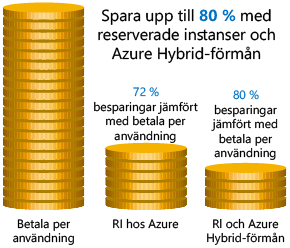
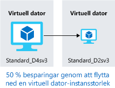
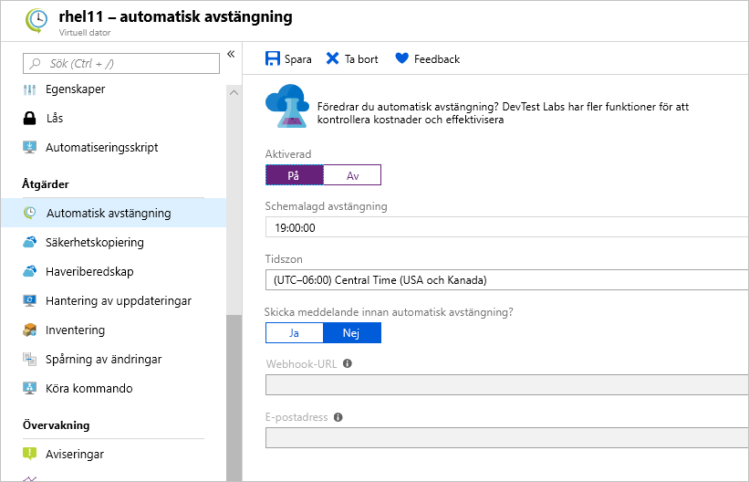

Vi har gått igenom hur du skapar kostnadsuppskattningar för miljöer du vill skapa, vi har tittat på några verktyg som ger information om vart pengarna går och skapat prognoser för framtida utgifter. Nästa utmaning är att titta på hur du kan sänka dina infrastrukturkostnader.

## Använda reserverade instanser

Om du har VM-arbetsbelastningar som är statiska och förutsägbara till sin natur, särskilt om de körs dygnet runt hela året, kan du spara upp till 70–80 procent genom att använda reserverade instanser beroende på de virtuella datorernas storlek. Följande illustration visar att du sparar upp till 72 % om du använder reserverade instanser för Azure och sparar upp till 80 % i kostnader om du använder reserverad instans plus Azure Hybrid-förmåner.

Reserverade instanser köps under ett eller tre år, och du betalar för hela perioden i förskott. Efter köpet matchar Microsoft reservationen mot de instanser som körs och minskar antalet timmar i reservationen. Du kan köpa reservationer via Azure Portal. Eftersom reserverade instanser utgör en rabatt på databehandlingen är de tillgängliga för både Windows- och Linux-datorer.

## Ange rätt storlek för underutnyttjade virtuella datorer

Tidigare tog vi upp att Azure Cost Management och Azure Advisor kan rekommendera att du ändrar storlek på eller stänger av virtuella datorer. Det här handlar om att dina virtuella datorer ska ha rätt storlek för uppgiften. Låt oss anta att du har en server som körs som en domänkontrollant och har storleken **Standard_D4sv3**, men den virtuella datorn är inaktiv till 90 % större delen av tiden. Genom att ändra storlek på den virtuella datorn till **Standard_D2sv3** kan du minska kostnaden för databehandlingen med 50 %. Kostnaderna är linjära och fördubblas för varje större storlek i samma serie. I det här fallet kan du kanske även spara ännu mer genom att byta till en enklare serie virtuella datorer. Följande illustration visar en besparing på 50 % som uppnås genom att gå ned en storlek inom samma serie.

Över stora virtuella datorer är en gemensam onödiga utgift på Azure och en som enkelt kan åtgärdas. Du kan ändra storleken på en virtuell dator via Azure Portal, Azure PowerShell eller Azure CLI.

> [!TIP]
> När du ändrar storlek på en virtuell dator måste du stoppa den, ändra storleken och sedan starta om datorn. Det här kan ta några minuter beroende på hur stor ändringen är. Planera för ett avbrott eller flytta trafiken till en annan instans medan du utför den här uppgiften.

## Frigöra virtuella datorer utanför normal arbetstid

Om du har arbetsbelastningar på virtuella datorer som endast används under vissa perioder, men du kör dem kontinuerligt, så slösar du pengar. De här virtuella datorerna kan stängas av när de inte används och sedan startas enligt ett schema, så att du sparar in på datorkostnaderna när den virtuellt datorn är frigjord.

Den här metoden passar utmärkt för utvecklingsmiljöer. Utveckling sker ofta bara under arbetstid, och då kan du frigöra systemen utanför normal arbetstid så att du inte ådrar dig några beräkningskostnader. Azure har nu en [automatiseringslösning](https://docs.microsoft.com/azure/automation/automation-solution-vm-management) som du kan använda i din miljö.

Du kan också använda funktionen för automatisk avstängning om du vill schemalägga avstängningen av en virtuell dator.

## Ta bort virtuella datorer som inte används

 Det här rådet kan låta uppenbart, men om du inte använder en tjänst bör du stänga av den. Det är inte ovanligt att hitta system som använts utanför produktion eller till konceptbeskrivningar, som inte längre behövs eftersom projektet är avslutat. Gå regelbundet igenom din miljö och försök identifiera sådana system. Det kan också vara bra att stänga av sådana system eftersom du även kan spara pengar på licenser och drift.

## Migrera till PaaS- eller SaaS-tjänster

När du migrerar arbetsbelastningar till molnet är det naturligt att börja med IaaS-tjänster och sedan stegvis flytta över lämpliga arbetsbelastningar till PaaS.

PaaS-tjänster kan ofta ge betydande besparingar både när det gäller resurser och drift. Beroende på typen av tjänst så krävs det olika mycket tid och resurser till att flytta tjänsterna. Du kanske enkelt kan flytta en SQL Server-databas till Azure SQL Database, men det kan vara betydligt svårare att flytta dina program med flera nivåer till en container eller en serverfri arkitektur. Det är en bra idé att kontinuerligt utvärdera arkitekturen i dina program och avgöra om du kan göra dem effektivare genom att övergå till PaaS-tjänster.

Med Azure kan du testa de här tjänsterna riskfritt eftersom du relativt enkelt kan prova nya arkitekturmönster. Det här är dock normalt en längre process och kanske inte är till hjälp omedelbart om du är ute efter snabba kostnadsbesparingar. Azure Architecture Center är en bra plats för att få idéer om hur du kan omvandla ditt program, där du även hittar metodtips för en mängd olika arkitekturer och Azure-tjänster.
